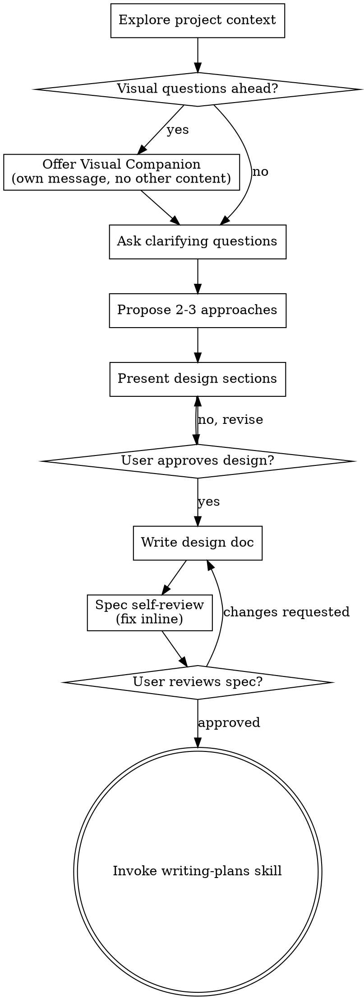

# Brainstorming Ideas Into Designs

通过自然的协作对话，帮助把想法变成完整 designs 和 specs。

先理解当前 project context，然后一次问一个问题来细化想法。当你理解要构建什么后，展示 design 并取得用户批准。

<HARD-GATE>
在你展示 design 并且用户批准之前，不要调用任何 implementation skill、不要写任何 code、不要 scaffold 任何 project，也不要采取任何 implementation action。无论项目看起来多简单，这适用于每一个项目。
</HARD-GATE>

## Anti-Pattern: "This Is Too Simple To Need A Design"

每个项目都要经过这个过程。Todo list、single-function utility、config change，全都一样。"Simple" projects 最容易因为未检查的 assumptions 造成浪费。Design 可以很短（真正简单的项目几句话即可），但你必须展示它并取得批准。

## Checklist

你必须为以下每一项创建 task，并按顺序完成：

1. **Explore project context** — 检查 files、docs、recent commits
2. **Offer visual companion**（如果 topic 会涉及 visual questions）— 这必须是单独一条消息，不要和澄清问题合并。见下方 Visual Companion 部分。
3. **Ask clarifying questions** — 一次一个问题，理解 purpose/constraints/success criteria
4. **Propose 2-3 approaches** — 包含 trade-offs 和你的 recommendation
5. **Present design** — 按复杂度分段展示，每段后取得用户 approval
6. **Write design doc** — 保存到 `docs/superpowers/specs/YYYY-MM-DD-<topic>-design.md` 并 commit
7. **Spec self-review** — 快速 inline 检查 placeholders、contradictions、ambiguity、scope（见下方）
8. **User reviews written spec** — 继续前请用户 review spec file
9. **Transition to implementation** — 调用 writing-plans skill 创建 implementation plan

## Process Flow

**terminal state 是调用 writing-plans。** 不要调用 frontend-design、mcp-builder 或任何其他 implementation skill。brainstorming 之后唯一调用的 skill 是 writing-plans。

## 流程

**理解想法：**

- 先检查当前 project state（files、docs、recent commits）
- 询问细节前先评估 scope：如果请求描述多个独立 subsystems（例如 "build a platform with chat, file storage, billing, and analytics"），立即指出。不要花问题去细化一个首先需要拆解的项目。
- 如果项目太大，不适合单个 spec，帮助用户拆成 sub-projects：独立 pieces 是什么、它们如何关联、应该按什么顺序构建？然后按正常 design flow brainstorm 第一个 sub-project。每个 sub-project 都有自己的 spec → plan → implementation cycle。
- 对 scope 合适的项目，一次问一个问题来细化 idea
- 尽量使用 multiple choice questions，但 open-ended 也可以
- 每条消息只问一个问题。如果某个 topic 需要更多探索，拆成多个问题
- 聚焦理解：purpose、constraints、success criteria

**探索 approaches：**

- 提出 2-3 个不同 approaches，并说明 trade-offs
- 用对话方式展示 options，包含你的 recommendation 和 reasoning
- 先给出推荐选项并解释原因

**展示 design：**

- 一旦你认为自己理解要构建什么，展示 design
- 每个 section 的长度按复杂度缩放：简单内容几句话即可，复杂内容可到 200-300 words
- 每个 section 后询问到目前为止是否正确
- 覆盖：architecture、components、data flow、error handling、testing
- 如果哪里不清楚，准备回头澄清

**为 isolation 和 clarity 设计：**

- 把系统拆成更小的 units：每个 unit 都有明确目的，通过 well-defined interfaces 沟通，并能独立理解和测试
- 对每个 unit，你都应该能回答：它做什么、怎么使用、依赖什么？
- 不读 internals 的情况下，别人能理解 unit 做什么吗？你能改 internals 而不破坏 consumers 吗？如果不能，boundaries 需要调整。
- 更小、边界清晰的 units 也更容易让你工作：你对能一次装进 context 的代码推理更好；当文件聚焦时，edits 更可靠。文件变大通常意味着它做了太多。

**在 existing codebases 中工作：**

- 提议 changes 前先探索当前 structure。遵循 existing patterns。
- 如果 existing code 中有影响工作的 problems（例如某个文件变得太大、boundaries 不清、responsibilities tangled），把 targeted improvements 纳入 design：像好开发者一样改善正在工作的代码。
- 不要提议 unrelated refactoring。只聚焦服务当前目标的内容。

## Design 之后

**Documentation：**

- 把 validated design（spec）写到 `docs/superpowers/specs/YYYY-MM-DD-<topic>-design.md`
  - （用户对 spec location 的偏好会覆盖这个默认值）
- 如果可用，使用 elements-of-style:writing-clearly-and-concisely skill
- Commit design document 到 git

**Spec Self-Review:**
写完 spec document 后，用 fresh eyes 看它：

1. **Placeholder scan:** 有没有 "TBD"、"TODO"、不完整 sections 或 vague requirements？修掉。
2. **Internal consistency:** sections 是否互相矛盾？architecture 是否匹配 feature descriptions？
3. **Scope check:** 这个是否足够聚焦，能进入单个 implementation plan？还是需要 decomposition？
4. **Ambiguity check:** 是否有任何 requirement 可能被两种方式理解？如果有，选择一种并写明确。

直接 inline 修复所有问题。不需要重新 review，修完继续。

**User Review Gate:**
spec review loop 通过后，请用户在继续前 review written spec：

> "Spec written and committed to `<path>`. Please review it and let me know if you want to make any changes before we start writing out the implementation plan."

等待用户回应。如果他们要求 changes，修改并重新运行 spec review loop。只有用户批准后才能继续。

**Implementation：**

- 调用 writing-plans skill 创建 detailed implementation plan
- 不要调用任何其他 skill。writing-plans 是下一步。

## Key Principles

- **One question at a time** - 不要用多个问题压倒用户
- **Multiple choice preferred** - 在可行时，比 open-ended 更容易回答
- **YAGNI ruthlessly** - 从所有 designs 中移除不必要 features
- **Explore alternatives** - 定案前始终提出 2-3 个 approaches
- **Incremental validation** - 展示 design，获得 approval 后再继续
- **Be flexible** - 不清楚时回头澄清

## Visual Companion

一个基于 browser 的 companion，用于在 brainstorming 期间展示 mockups、diagrams 和 visual options。它是 tool，不是 mode。接受 companion 意味着它可用于适合 visual treatment 的问题；并不意味着每个问题都要走 browser。

**Offering the companion:** 当你预期接下来的问题会涉及 visual content（mockups、layouts、diagrams）时，先请求一次 consent：
> "Some of what we're working on might be easier to explain if I can show it to you in a web browser. I can put together mockups, diagrams, comparisons, and other visuals as we go. This feature is still new and can be token-intensive. Want to try it? (Requires opening a local URL)"

**这个 offer 必须是独立消息。** 不要把它和澄清问题、context summaries 或任何其他内容合并。消息应只包含上面的 offer，什么都不要加。继续前等待用户回应。如果他们拒绝，继续 text-only brainstorming。

**Per-question decision:** 即使用户接受了，也要对每个问题分别决定使用 browser 还是 terminal。判断标准：**用户看到它会比读到它更容易理解吗？**

- **Use the browser** 处理真正 visual 的内容：mockups、wireframes、layout comparisons、architecture diagrams、side-by-side visual designs
- **Use the terminal** 处理文本内容：requirements questions、conceptual choices、tradeoff lists、A/B/C/D text options、scope decisions

关于 UI topic 的问题不自动等于 visual question。"What does personality mean in this context?" 是 conceptual question，用 terminal。"Which wizard layout works better?" 是 visual question，用 browser。

如果他们同意 companion，继续前阅读详细指南：
`skills/brainstorming/visual-companion.md`
