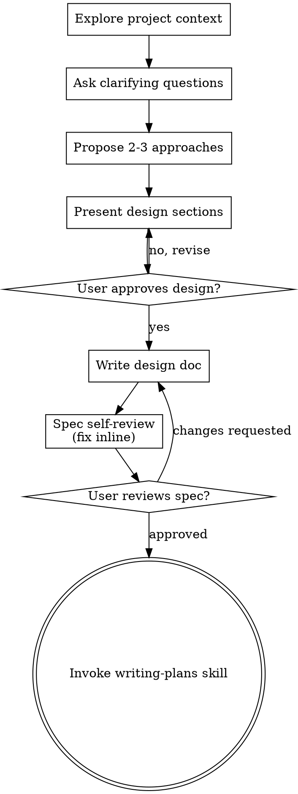

# Brainstorming Ideas Into Designs

通过自然的协作对话，帮助将想法转化为完整的设计和规格。

首先了解当前的项目背景，然后一次提出一个问题来完善想法。一旦您了解了您正在构建的内容，就可以展示设计并获得用户批准。

<HARD-GATE>
在您提出设计并获得用户批准之前，请勿调用任何实施技能、编写任何代码、构建任何项目或采取任何实施操作。这适用于每个项目，无论其简单性如何。
</HARD-GATE>

## 反模式："这太简单了，不需要设计"

每个项目都会经历这个过程。待办事项列表、单一功能实用程序、配置更改——所有这些。 "简单"项目是未经检验的假设导致最多浪费工作的地方。设计可以很短（真正简单的项目只需几句话），但您必须展示它并获得批准。

## Checklist

您必须为每个项目创建一个任务并按顺序完成它们：

1. **探索项目上下文** — 检查文件、文档、最近提交
2. **及时提供视觉伴侣**——而不是预先提供。当问题第一次真正比描述的更清晰时，就提出它（它自己的信息）；批准后，其浏览器选项卡将为您打开。如果没有出现任何视觉问题，就不要提出它。请参阅下面的视觉伴侣部分。
3. **提出澄清问题** — 一次一个，了解目的/constraints/success 标准
4. **提出 2-3 种方法** — 权衡利弊并提出您的建议
5. **当前设计** - 根据其复杂性按比例划分，在每个部分后获得用户批准
6. **编写设计文档** — 保存到 `docs/superpowers/specs/YYYY-MM-DD-<topic>-design.md` 并提交
7. **规范自我审查** - 快速内联检查占位符、矛盾、歧义、范围（见下文）
8. **用户审查书面规范** - 要求用户在继续之前审查规范文件
9. **过渡到实施** — 调用编写计划技能来创建实施计划

## Process Flow

**最终状态正在调用编写计划。** 不要调用前端设计、mcp-builder 或任何其他实现技能。头脑风暴后你调用的唯一技能就是编写计划。

## The Process

**理解这个想法：**

- 首先检查当前项目状态（文件、文档、最近提交）
- 在提出详细问题之前，评估范围：如果请求描述了多个独立的子系统（例如，"构建一个具有聊天、文件存储、计费和分析功能的平台"），请立即标记这一点。不要花问题来细化需要首先分解的项目细节。
- 如果项目对于单个规范来说太大，请帮助用户分解为子项目：哪些是独立的部分，它们如何关联，它们应该按什么顺序构建？然后通过正常的设计流程集思广益第一个子项目。每个子项目都有自己的规范→计划→实施周期。
- 对于范围适当的项目，一次提出一个问题来完善想法
- 尽可能选择多项选择题，但开放式问题也可以
- 每条消息只有一个问题 - 如果某个主题需要更多探索，请将其分解为多个问题
- 重点理解：目的、约束、成功标准

**Exploring approaches:**

- 提出 2-3 种不同的权衡方法
- 通过对话方式提出选项以及您的建议和推理
- 以您推荐的选项开头并解释原因

**展示设计：**

- 一旦您相信自己了解了自己正在构建的内容，就可以展示设计
- 根据每个部分的复杂程度调整：如果简单，则几句话；如果细致，则最多 200-300 个单词
- 在每个部分之后询问到目前为止看起来是否正确
- 涵盖：架构、组件、数据流、错误处理、测试
- 如果有些事情没有意义，准备好回去澄清

**隔离和清晰度的设计：**

- 将系统分解为更小的单元，每个单元都有一个明确的目的，通过明确定义的接口进行通信，并且可以独立理解和测试
- 对于每个单元，您应该能够回答：它是做什么的，如何使用它，以及它依赖什么？
- 有人能在不阅读其内部结构的情况下了解一个单元的功能吗？你能在不破坏消费者的情况下改变内部结构吗？如果没有，边界就需要工作。
- 更小的、边界明确的单元也更容易使用——您可以更好地推理可以立即在上下文中保存的代码，并且当集中文件时，您的编辑会更可靠。当文件变大时，这通常表明它做得太多了。

**在现有代码库中工作：**

- 在提出更改建议之前先探索当前的结构。遵循现有模式。
- 如果现有代码存在影响工作的问题（例如，文件变得太大、边界不清晰、责任混乱），请将有针对性的改进作为设计的一部分 - 优秀的开发人员改进他们正在使用的代码的方式。
- 不要提出不相关的重构。专注于服务于当前目标的事情。

## After the Design

**Documentation:**

- 将经过验证的设计（规格）写入`docs/superpowers/specs/YYYY-MM-DD-<topic>-design.md`
  - （规范位置的用户首选项会覆盖此默认值）
- 如果可以的话，使用风格元素：清晰简洁的写作技巧
- 将设计文档提交到git

**Spec Self-Review:**
写完spec文档后，用新的眼光来看待它：

1. **占位符扫描：** 有任何"TBD"、"TODO"、不完整的部分或模糊的要求吗？修复它们。
2. **内部一致性：** 有任何部分相互矛盾吗？架构与功能描述相符吗？
3. **范围检查：** 这对于单个实施计划来说是否足够集中，或者是否需要分解？
4. **歧义检查：**任何要求是否可以用两种不同的方式解释？如果是这样，请选择一个并明确说明。

修复任何内联问题。无需重新审查——只需修复并继续。

**用户评论门：**
规范审核循环通过后，要求用户在继续之前审核书面规范：

> "规范已编写并致力于`<path>`。在我们开始编写实施计划之前，请查看该规范并告知我是否想要进行任何更改。"

等待用户的回应。如果他们请求更改，请进行更改并重新运行规范审核循环。仅在用户批准后才继续。

**Implementation:**

- 调用写作计划技能来创建详细的实施计划
- 不要调用任何其他技能。下一步是编写计划。

## Key Principles

- **一次一个问题** - 不要因多个问题而不知所措
- **首选多项选择** - 如果可能的话，比开放式更容易回答
- **YAGNI 无情** - 从所有设计中删除不必要的功能
- **探索替代方案** - 在解决之前始终提出 2-3 种方法
- **增量验证** - 展示设计，在继续之前获得批准
- **保持灵活性** - 当某些事情没有意义时返回并澄清

## Visual Companion

一个基于浏览器的伴侣，用于在头脑风暴期间显示模型、图表和视觉选项。作为一种工具提供——而不是一种模式。接受同伴意味着它可以回答从视觉治疗中受益的问题；这并不意味着每个问题都会通过浏览器。

**提供同伴（及时）：** 不要预先提供。等到问题真正显示得比告诉的更清楚——一个真正的模型/布局/图表问题，而不仅仅是一个 UI *主题*。第一次发生这种情况时，将其作为自己的消息提供：
> "如果我向您展示，下一部分可能会更容易 - 我可以在浏览器选项卡中将模型、图表和比较放在一起。它仍然是新的，并且可能是令牌密集型的。需要我这样做吗？我会为您打开它。"

**此要约必须是其自己的消息。** 仅是要约 - 没有澄清问题、摘要或其他内容。等待用户的回应。如果他们接受，请使用 `--open` 启动服务器，以便他们的浏览器自动打开到第一个屏幕。如果他们拒绝，请继续仅发送短信，除非他们提出，否则不要再次提供。

**每个问题的决定：** 即使在用户接受之后，也要为每个问题决定是否使用浏览器或终端。测试：**用户通过查看它会比阅读它更好地理解它吗？**

- **使用浏览器**获取视觉内容 - 模型、线框图、布局比较、架构图、并排视觉设计
- **使用终端**获取文本内容 - 需求问题、概念选择、权衡列表、A/B/C/D 文本选项、范围决策

有关 UI 主题的问题不会自动成为视觉问题。 "在这种情况下，个性意味着什么？"是一个概念性问题——使用终端。 "哪种向导布局效果更好？"是一个视觉问题——使用浏览器。

如果他们同意同伴的意见，请先阅读详细指南，然后再继续：
`skills/brainstorming/visual-companion.md`
