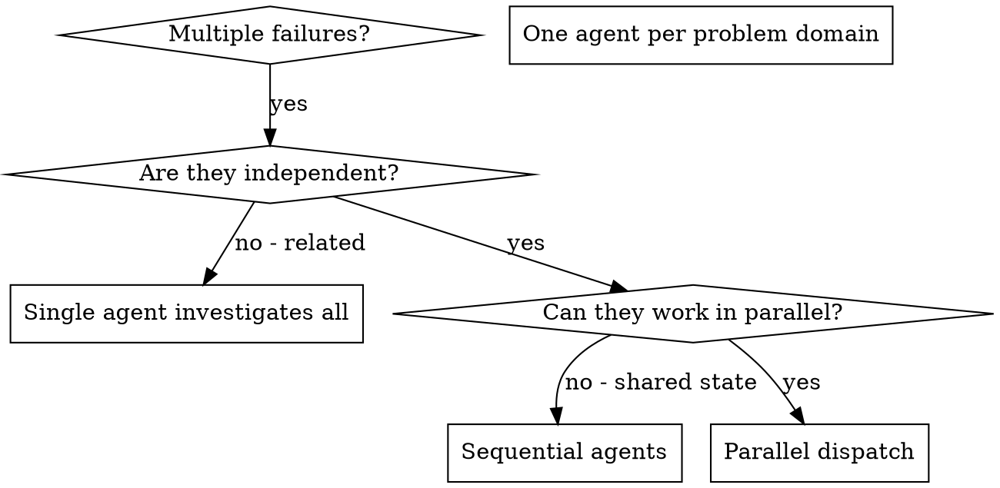

# Dispatching Parallel Agents

## 概览

你把 tasks 委派给带 isolated context 的 specialized agents。通过精确构造它们的 instructions 和 context，你能确保它们保持专注并完成 task。它们永远不应该继承你的 session context 或 history；你只构造它们真正需要的内容。这也会保留你自己的 context，用于协调工作。

当你有多个无关 failures（不同 test files、不同 subsystems、不同 bugs）时，顺序调查会浪费时间。每项 investigation 都是独立的，可以并行发生。

**核心原则：** 每个独立 problem domain 分派一个 agent。让它们并发工作。

## 何时使用



**Use when:**
- 3+ test files 因不同 root causes 失败
- 多个 subsystems 独立损坏
- 每个问题都能在不依赖其他 context 的情况下理解
- investigations 之间没有 shared state

**Don't use when:**
- Failures 相关（修一个可能修好其他）
- 需要理解 full system state
- Agents 会互相干扰

## Pattern

### 1. 识别 Independent Domains

按 broken 内容分组 failures：
- File A tests: Tool approval flow
- File B tests: Batch completion behavior
- File C tests: Abort functionality

每个 domain 都独立：修 tool approval 不会影响 abort tests。

### 2. 创建 Focused Agent Tasks

每个 agent 都拿到：
- **Specific scope:** 一个 test file 或 subsystem
- **Clear goal:** 让这些 tests pass
- **Constraints:** 不要改其他代码
- **Expected output:** 你发现了什么、修了什么的 summary

### 3. 并行 Dispatch

```typescript
// In Claude Code / AI environment
Task("Fix agent-tool-abort.test.ts failures")
Task("Fix batch-completion-behavior.test.ts failures")
Task("Fix tool-approval-race-conditions.test.ts failures")
// All three run concurrently
```

### 4. Review and Integrate

Agents 返回后：
- 阅读每份 summary
- 验证 fixes 不冲突
- 运行 full test suite
- 整合所有 changes

## Agent Prompt Structure

好的 agent prompts 具备：
1. **Focused** - 一个清楚的 problem domain
2. **Self-contained** - 理解问题所需的全部 context
3. **Specific about output** - agent 应该返回什么？

```markdown
Fix the 3 failing tests in src/agents/agent-tool-abort.test.ts:

1. "should abort tool with partial output capture" - expects 'interrupted at' in message
2. "should handle mixed completed and aborted tools" - fast tool aborted instead of completed
3. "should properly track pendingToolCount" - expects 3 results but gets 0

These are timing/race condition issues. Your task:

1. Read the test file and understand what each test verifies
2. Identify root cause - timing issues or actual bugs?
3. Fix by:
   - Replacing arbitrary timeouts with event-based waiting
   - Fixing bugs in abort implementation if found
   - Adjusting test expectations if testing changed behavior

Do NOT just increase timeouts - find the real issue.

Return: Summary of what you found and what you fixed.
```

## 常见错误

**❌ Too broad:** "Fix all the tests" - agent 会迷路
**✅ Specific:** "Fix agent-tool-abort.test.ts" - focused scope

**❌ No context:** "Fix the race condition" - agent 不知道在哪里
**✅ Context:** 粘贴 error messages 和 test names

**❌ No constraints:** Agent 可能重构一切
**✅ Constraints:** "Do NOT change production code" 或 "Fix tests only"

**❌ Vague output:** "Fix it" - 你不知道改了什么
**✅ Specific:** "Return summary of root cause and changes"

## 何时不要使用

**Related failures:** 修一个可能修好其他，先一起调查
**Need full context:** 理解问题需要看到整个系统
**Exploratory debugging:** 你还不知道哪里坏了
**Shared state:** Agents 会互相干扰（编辑同一文件、使用同一资源）

## Session 中的真实示例

**Scenario:** major refactoring 后，3 个文件中出现 6 个 test failures

**Failures:**
- agent-tool-abort.test.ts: 3 failures（timing issues）
- batch-completion-behavior.test.ts: 2 failures（tools not executing）
- tool-approval-race-conditions.test.ts: 1 failure（execution count = 0）

**Decision:** Independent domains：abort logic 与 batch completion、race conditions 彼此独立

**Dispatch:**
```
Agent 1 → Fix agent-tool-abort.test.ts
Agent 2 → Fix batch-completion-behavior.test.ts
Agent 3 → Fix tool-approval-race-conditions.test.ts
```

**Results:**
- Agent 1: Replaced timeouts with event-based waiting
- Agent 2: Fixed event structure bug（threadId in wrong place）
- Agent 3: Added wait for async tool execution to complete

**Integration:** 所有 fixes 独立，无 conflicts，full suite green

**Time saved:** 3 个问题并行解决，而不是顺序处理

## Key Benefits

1. **Parallelization** - 多个 investigations 同时发生
2. **Focus** - 每个 agent scope 窄，需要追踪的 context 更少
3. **Independence** - Agents 不会互相干扰
4. **Speed** - 用解决 1 个问题的时间解决 3 个

## Verification

Agents 返回后：
1. **Review each summary** - 理解改了什么
2. **Check for conflicts** - Agents 是否编辑了同一段 code？
3. **Run full suite** - 验证所有 fixes 一起工作
4. **Spot check** - Agents 可能犯系统性错误

## Real-World Impact

来自 debugging session（2025-10-03）：
- 3 个文件中 6 个 failures
- 并行分派 3 个 agents
- 所有 investigations 并发完成
- 所有 fixes 成功整合
- Agent changes 之间 zero conflicts
