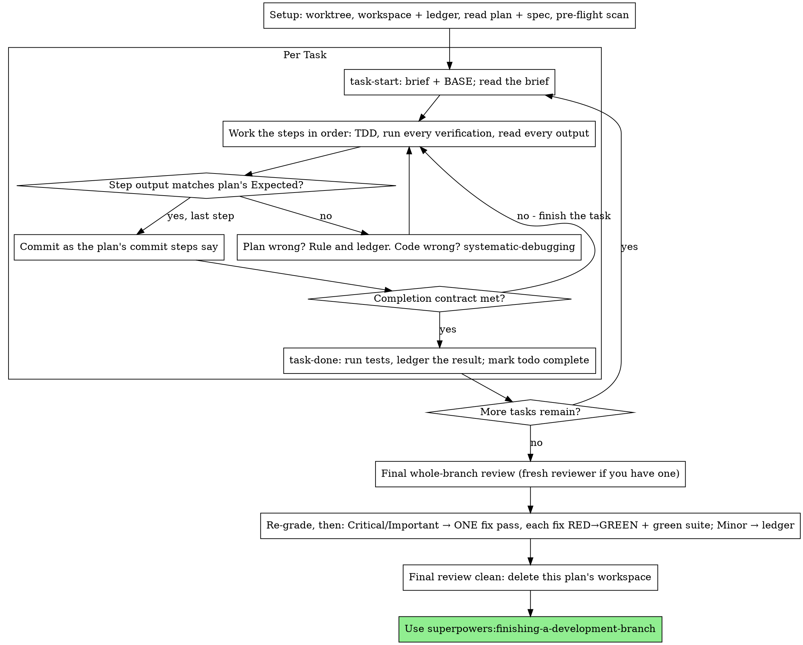

# Executing Plans

在当前 session 中逐个 task 亲自执行 plan：每个 task 不使用 implementer subagent，也不逐项安排 reviewer。最后对整个分支进行一次 fresh-context review。

**为什么选择 inline：** Subagent-driven development 会为每个 task 使用全新的 implementer 和 reviewer，两者都要从零读取 codebase。Inline execution 只使用一个 context（你的）并在最后使用一名 reviewer。它放弃了每个 task 的 fresh context 和第二双眼睛。本 skill 用其他方式保留两者带来的保障：brief 是 spec，ledger 是你的记忆，TDD 是逐 task 门禁，最终 reviewer 是第二双眼睛。

**核心原则：** Plan 已经完成思考。严格执行它，用你亲眼看到先失败、再通过的测试证明每一步，并留下即使自己遗忘也能延续的记录。

**叙述：** 两次工具调用之间最多只叙述一行；记录由 ledger 和工具结果承载。

**连续执行：** 不要在 tasks 之间停下来向 human partner 确认。他们选择 inline execution 是为了降低成本，不是为了每个 task 后回答“要继续吗？”。不停顿地执行 plan 中所有 tasks。

**作出裁决，而不是停滞。** 遇到冲突、歧义或 plan 缺陷时，作出决定。Spec 是约束性权威，plan 是它的论证，两者都没有回答时由你的判断裁决。把每个决定写入 ledger：`Ruling: <what you decided> — <why> — <what it costs if wrong>`，然后继续。偏离 plan 却不记录 ruling，就是秘密作出决定。

只有四种情况可以停止：不可逆或破坏性操作；安全敏感操作；按惯例应先询问、且会影响本 worktree 之外的副作用（merge、push 到共享分支、publish）；plan 损坏到任何前进路径都只能猜测。遇到这些情况时停止并询问。

## 何时使用

- 你已有来自 superpowers:writing-plans 的 plan，并且 human partner 在交接时选择 inline execution。
- Harness 没有 subagent 工具（参见 `../using-superpowers/references/` 中各平台 reference）。绝不要伪造 dispatch；直接在这里执行 plan。
- Tasks 大多相互独立，与 superpowers:subagent-driven-development 的前置条件相同。

完整定义的 plan 会把 inline execution 变成转录加测试：它能在中等档位的 session model 上良好运行；最强 model 最值得投入的地方是最终 review，本 skill 会单独 dispatch。Human partner 选择 inline 时，要告诉他们这一点。

当 human partner 希望每个 task 都有 review 门禁，或 plan 长到后续 tasks 会运行在 compacted context 中时，优先使用 superpowers:subagent-driven-development。长 plan 仍可 inline 执行，ledger 让它可恢复，但最后的 tasks 得到的 context 最少。

## 流程



## Setup

确保工作在 isolated workspace 中进行：使用 superpowers:using-git-worktrees 创建或验证现有 worktree。未经 human partner 明确同意，绝不要在 main/master 分支上开始实现。

对话记忆无法跨越 compaction。Inline executor 一旦丢失位置，就会重新实现已有 commit 的 tasks，这与 controller 重复 dispatch 的失败相同，只是成本消耗在你自己的 context 上。必须用 ledger 文件跟踪进度，不能只依赖 todos。Harness todos 是实时视图，ledger 才是记录。

Workspace 和 ledger 与 superpowers:subagent-driven-development 共享相同目录和格式，因此 plan 可以在执行中途更换 executor，新 executor 能从同一 ledger 恢复。

- 每个 plan 独占一个 workspace：skill 启动时运行 `../subagent-driven-development/scripts/sdd-workspace PLAN_FILE`。它会打印该 plan 的 git-ignored 目录（`<repo-root>/.superpowers/sdd/<plan-basename>/`），其中保存该 plan 的所有 artifacts：ledger、briefs、review packages。绝不要读写其他 plan 的目录。
- 在 `<workspace>/progress.md` 检查本 plan 的 ledger。若第一行指向你的 plan 文件，则含 `Task <N>: complete` 行的 tasks 已经完成，不要重做；从第一个没有该行的 task 恢复。即使你的 context 不记得做过，commits 仍存在于 git 中；compaction 后应信任 ledger 和 `git log`，而不是自己的记忆。如果 ledger 第一行指向另一个 plan 文件，那是其他 plan 的进度；保持不动，为自己新建 ledger。
- Ledger 第一行写入身份：`# SDD ledger — plan: <plan file path>`。
- `git clean -fdx` 会销毁 workspace（它是 git-ignored scratch）；若发生这种情况，从 `git log` 恢复。

完整读取 plan 一次，记下 context 和 Global Constraints，并为每个 task 创建 todo。如果 plan 指定了 Spec，也要读取：spec 是 plan 所依托的权威，plan 内的冲突必须依据它解决。若 spec 无法访问，在 ledger 记录；没有 spec 时作出的 rulings 都是临时的。

**REQUIRED SUB-SKILL：** 在 Task 1 之前立即加载 superpowers:test-driven-development。它约束下面每个 task 的每一步；即使 plan steps 已写明“先写失败测试”，也不能因此不读取该 skill。

在 Task 1 前扫描 tasks 之间的冲突。Plan 的 Interfaces blocks 指明检查位置：对每个消费早期 task 产物的 task，在 ledger 写一行，记录两个 tasks、前者产出与后者消费的对照，以及检查结果。没有共享内容的 task 不写行；整个 plan 没有任何共享接口时只写 `Pre-flight: no shared interfaces`。以 spec 为约束性权威裁决每个暴露出的冲突，在相应行旁记录 ruling，然后开始 Task 1。每个 task 自身的文本在读取其 brief 时检查，而不是现在。

## Task 循环

你打印的所有内容和每个工具结果都会在 session 剩余期间驻留于 context。把长测试输出重定向到 workspace 文件并读取 tail；读取 brief，不要反复读取整个 plan。

### 1. 领取 task

- 运行本 skill 的 `scripts/task-start PLAN_FILE N`。它会在一次调用中打印 brief 路径和 BASE（该 task diff range 的起始 commit）。每个 task 都必须读取 brief，包括 setup 时还记得的内容：记忆只是摘要，brief 包含精确值、signatures 和 test cases。
- 将该 task 的 todo 标为 in_progress。

每次工具调用都是重新读取整个 context 的一轮。Bookkeeping 要和工作一起完成：ledger append 与 commit 放在同一次调用中，绝不要单独调用一次只写 ledger。

### 2. 执行 steps

Plan steps 已按 RED-GREEN 排序；在 setup 时加载的 superpowers:test-driven-development 约束下，按顺序执行。测试 step 的代码必须先写、先运行。亲眼看到它失败是一个 step，不是形式；如果实现尚不存在时测试就通过，这是关于测试本身的 finding。

每个运行命令的 step 都有 `Expected:` 行。运行命令，读取输出并比较。只有三种结果：

- **匹配。** 进入下一 step。
- **代码错误。** 使用 superpowers:systematic-debugging 查找原因；绝不要为让输出匹配而修补症状。
- **Plan 错误。** 例如 step 与 spec 冲突、早期 task 的接口不匹配当前 task 的消费、命令无法工作。裁决满足 spec 的最小变更，在 ledger 记录 `Task <N>: Ruling: <finding> — <what you decided and why>`，然后继续。Ruling 必须被携带而不是记在脑中：后续触碰同一接口的 tasks 从 ledger 读取。

按 plan 的 commit steps 提交。一个 task 跨多个 commits 没问题；review range 始终从 BASE 开始，绝不要使用会漏掉多 commit task 前面提交的 `HEAD~1`。

### 3. 完成契约

在写入 task ledger 行之前，下面所有事项都必须成立，并且当前 session 有证据，不能只根据 diff 看起来正确进行推断：

- Brief 指定的每个测试都存在、都在该 task 中运行过，而且你读取了输出。
- 该 task 最终测试运行通过；`task-done` 就是这次运行，它会把命令和结果写入 ledger 行。
- Brief 中每个 `Expected:` 行都与真实输出比较过。
- 对 brief 的每次偏离都在 ledger 中有 `Ruling:` 行。

**REQUIRED SUB-SKILL：** superpowers:verification-before-completion 约束这个完成声明。如果缺少任何一项，task 就未完成，先补齐。

### 4. 完成 task

运行本 skill 的 `scripts/task-done PLAN_FILE N BASE -- <test command>`，使用 brief 为整个 task 指定的测试命令。它会运行测试，把完整输出保存在 workspace，打印 tail，并且仅在测试通过时向 ledger 追加完成行：

`Task <N>: complete (commits <base7>..<head7>, tests: <command> → <result>)`

失败的运行不会记录任何内容，task 也未完成。记录成功后，将 todo 标为 complete，并领取下一 task。

## 最终 Review

运行 `../subagent-driven-development/scripts/review-package PLAN_FILE MERGE_BASE HEAD`（MERGE_BASE 是分支开始时的 commit，例如 `git merge-base main HEAD`），并从它打印的文件进行 review。

**有 subagent 工具时：** 使用可用的最强 model dispatch reviewer；整个分支的 review 是判断任务。使用 superpowers:requesting-code-review 的 [code-reviewer.md](../requesting-code-review/code-reviewer.md)，提供 package 路径、plan 和 spec 路径、plan 的 Review Focus 原文（若存在；它列出 plan 测试未覆盖的 input classes 和 failure modes，reviewer 要逐项检查），以及 ledger 中 `Ruling:` 行的指针，让 reviewer 能权衡你的决定。必须明确指定 model；省略时会继承 session model，它未必最强。这是整个执行唯一购买的 fresh context。绝不要跳过，也不要用自己阅读 diff 替代。

**没有 subagent 工具时：** 读取 code-reviewer.md，并在最后一个 task 的 ledger 行之后，对 package 做一次独立 self-review。在 ledger 写入 `Final review: self-review (no subagent tool)`，并在最终消息说明：作者 self-review 弱于 fresh reviewer，是否足够应由 human partner 在 merge 前决定。

采取任何行动前，先对 findings 分类。Reviewer 的 severity label 只是建议，门禁由你负责。它的 “Declined to judge” 列表同样归你处理：每一行都必须像 plan 冲突一样由你裁决并写入 ledger：`Final: Ruling: <behavior the reviewer set aside> — <what a reasonable person using this software gets, and why that stands or why it is now a finding> — <cost if wrong>`。首先按影响重新定级：spec 是愿景文档，finding 等级取决于合理用户在发布后得到什么，而不是 spec 是否写出触发条件。Reviewer 因 spec 沉默而把 finding 定为 Minor，是在给 spec 评分，而不是给影响评分。然后：

- **Critical 和 Important** 进入 fix pass。
- **Minor** 写入 ledger：`Final: minor (deferred): <one-liner>`，并放入最终消息的 “Deferred minors”。Minor 永远不进入 fix pass，也不会变成 ruling；ruling 是对冲突的决定，不是拒绝 polish 建议的记录。

Critical 和 Important findings 由你亲自修复，你就是这里的 implementer，并且只进行一次 fix pass。每项修复都用 TDD 验证，不使用第二位 reviewer：写出复现 finding 的测试，观察失败，使其通过，再运行完整 suite。在 ledger 记录：`Final: fixed <finding> — <test name> RED→GREEN, suite <N>/<N>`。没有先失败的测试就不算已验证；fix pass 后 suite 不绿则 fix pass 尚未结束。不要 dispatch re-review：它只会重读已经由覆盖测试回答 “addressed”、由 suite 回答 “broke nothing” 的 diff。

决定不修的 finding 是 ruling：`Final: Ruling: <finding> — <why the code stands> — <cost if wrong>`，并必须进入给 human partner 的 rulings list。不存在第二次 fix pass。

## 收尾

删除任何内容前，把 ledger 中每一条含 `Ruling:` 的行按作出顺序收集到最终消息的 “Rulings I made”，每条都附上错误成本；把每一条 `minor (deferred)` 放到 “Deferred minors”。两个列表必须完整。最终消息是你代表 human partner 作出的决定，以及选择不处理 findings 的唯一交付渠道。

最终 review 干净且修复已提交后，删除该 plan 的 workspace 目录；记录现在位于 git history。Sibling 目录属于其他 plans，不要触碰。

使用 superpowers:finishing-a-development-branch。

## 常见合理化借口

| 借口 | 事实 |
|--------|---------|
| “我记得 Task N 的内容” | 你只记得摘要。Brief 才有精确值。读取它。 |
| “Plan 的代码是对的，可以不看测试失败” | 没见过失败的测试什么都不能证明。这只是一步。运行它。 |
| “我会在最后运行完整 suite，不必逐 step 运行” | 逐 step 运行才能知道哪一步破坏了系统。Task 末运行是契约，不是替代品。 |
| “Plan 这里错了，我直接做正确的事” | 做正确的事，并把 ruling 写进 ledger。未记录的偏离是秘密决定。 |
| “做完几个 tasks 后再补 ledger” | Compaction 不会等待合适时机。每个 task 一行，与 commit 同一消息写入。 |
| “开始下个 task 前先确认一下” | 他们选择 inline 是为了降低成本。进度确认在消耗他们的时间。只有四种停止条件可以让你停下。 |
| “我仔细读了自己的 diff，最终 reviewer 多余” | 同一作者有同样盲点。Reviewer 是整个执行唯一获得的 fresh context。 |
| “测试应该会通过，变更很小” | “应该”不是证据。契约要求真实命令和输出。 |
| “Subagents 又慢又贵，最终 review 也跳过” | Inline 已移除逐 task reviewer。整个分支一次 review 是底线，不是上限。 |
| “Reviewer 说是 Minor，所以就是 Minor” | 该 label 可能只反映 spec 沉默。应根据用户实际得到的结果定级，再应用门禁。 |
| “修复显而易见，不需要先失败的测试” | 失败测试是 finding 曾真实存在、现在消失的唯一证明。否则只有 diff 和希望。 |
| “我顺手也修掉 minors” | 每个 minor 都需要用户未要求的测试、修复和 suite 运行。记录它们，由 human partner 决定。 |

## 示例工作流

```
You: I'm using the executing-plans skill to implement this plan inline.

[Setup: worktree verified]
[Read plan once: docs/superpowers/plans/feature-plan.md; spec read]
[Resolve workspace: sdd-workspace docs/superpowers/plans/feature-plan.md — no ledger inside, fresh start]
[Pre-flight scan: 2 shared-interface rows, 4 self-consistency rows, clean; written to ledger]
[Create todos for all tasks]

Task 1: Hook installation script

[task-start plan 1 → brief read; BASE a1b2c3d]
[Step 1: write failing test — written]
[Step 2: run it — FAIL: install_hook not defined. Matches Expected.]
[Step 3: implement — written]
[Step 4: run it — PASS 1/1. Matches Expected.]
[Step 5: commit — d4e5f6a]
[Contract: tests ran, output read, no deviations]
[task-done plan 1 a1b2c3d -- npm test -- hooks → ledger: Task 1: complete (commits a1b2c3d..d4e5f6a, tests: npm test -- hooks → 1/1 pass)]

Task 2: Recovery modes

[task-start plan 2 → brief read; BASE d4e5f6a]
[Step 2: run failing test — FAIL, but on an import error: Task 1 exported
 installHook, brief consumes install_hook]
[Ruling: brief's consumer name is a typo against Task 1's Produces block;
 use installHook — Ledger: Task 2: Ruling: install_hook → installHook — matches Task 1 Produces — cost if wrong: one rename]
[Steps 2-5 as planned; commit b7c8d9e]
[task-done plan 2 d4e5f6a -- npm test -- recovery → ledger: Task 2: complete (commits d4e5f6a..b7c8d9e, tests: npm test -- recovery → 8/8 pass)]

...

[After all tasks: review-package plan MERGE_BASE HEAD; dispatch code-reviewer, most capable model]
Reviewer: One Important finding — progress reporting interval hardcoded. Two Minor.
[Re-grade: Important stands; minors → ledger as deferred]
[Fix pass: test_progress_interval_configurable RED → extract PROGRESS_INTERVAL → GREEN; suite 12/12; commit]
[Ledger: Final: fixed hardcoded interval — test_progress_interval_configurable RED→GREEN, suite 12/12]

Rulings I made:
- Task 2: install_hook → installHook (brief typo; cost if wrong: one rename)

Deferred minors:
- README lacks a usage example
- recovery.js could split verify/repair into two files

[Delete this plan's workspace — the record now lives in git]

Using superpowers:finishing-a-development-branch.
```
