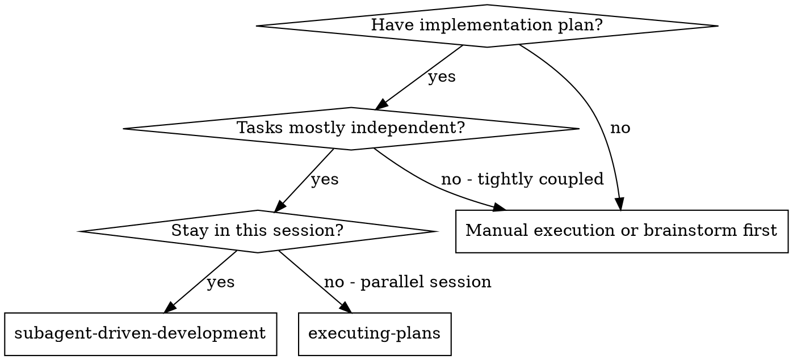
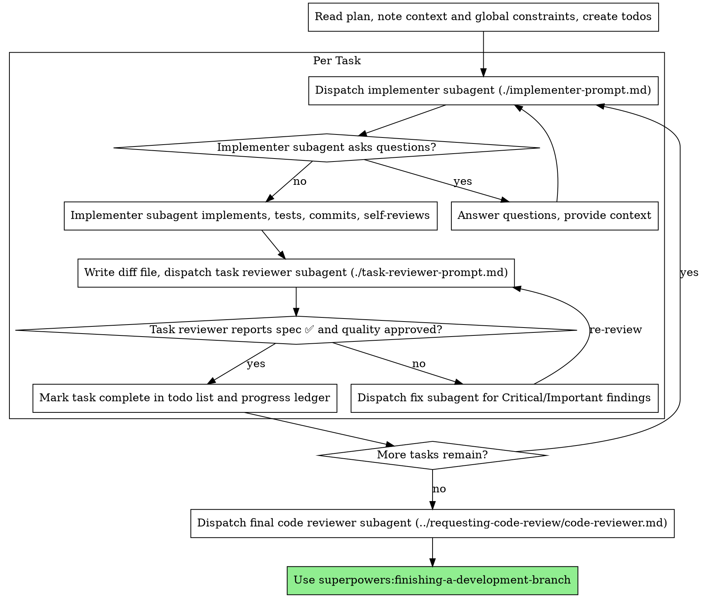

# Subagent-Driven Development

通过为每个任务派遣一个新的实施者子代理、在每个任务之后进行任务审查（规范合规性 + 代码质量）以及最后进行广泛的全分支审查来执行计划。

**为什么使用子代理：** 您可以将任务委托给具有隔离上下文的专门代理。通过精确地制定他们的指示和背景，您可以确保他们保持专注并成功完成任务。他们永远不应该继承你的会话的上下文或历史——你构建的正是他们所需要的。这也保留了您自己的协调工作环境。

**核心原则：** 每个任务新鲜的子代理+任务审查（规格+质量）+广泛的最终审查=高质量，快速迭代

**旁白：** 在工具调用之间，最多旁白一小行 —
账本和工具结果进行记录。

**持续执行：** 在任务之间不要停下来与您的人类合作伙伴核对。不间断地执行计划中的所有任务。停止的唯一原因是：无法解决的"阻塞"状态、真正阻碍进度的歧义或所有任务已完成。 "我应该继续吗？"提示和进度总结浪费了他们的时间——他们要求你执行计划，所以执行它。

## 何时使用



**与 Executing Plans（parallel session）的区别：**
- 同一会话（无上下文切换）
- 每个任务都有新的子代理（无上下文污染）
- 每项任务后进行审查（规范合规性+代码质量），最后进行广泛审查
- 更快的迭代（任务之间没有人在循环）

## 流程



## 任务前计划审查

在分派任务 1 之前，扫描一次计划是否存在冲突：

- 相互矛盾的任务或计划的全局约束
- 计划明确规定审查标题将其视为
  缺陷（不断言任何内容的测试，逻辑块的逐字复制）

将你发现的所有内容作为一个批量问题呈现给你的人类伙伴 —
计划文本旁边的每项发现都规定了它，询问哪个管辖——
在执行开始之前，每个发现中间计划不会有一次中断。如果
扫描干净，继续，不加评论。审查循环仍然是网络
只有在实施过程中才会出现的冲突。

## 模型选择

使用可以处理每个角色的功能最弱的模型来节省成本并提高速度。

**机械实现任务**（独立的功能、清晰的规格、1-2 个文件）：使用快速、廉价的模型。当计划明确时，大多数实施任务都是机械的。

**集成判断任务**（多文件协调、模式匹配、调试）：使用标准模型。

**架构和设计任务**：使用功能最强大的可用模型。
最终的全部门审查就是其中之一 - 将其发送到最
有能力的可用模型，而不是会话默认模型。

**回顾任务**：选择具有相同判断的模型，缩放至
diff 的大小、复杂性和风险。小型机械差速器不需要
最有能力的模型；细微的并发变化确实如此。

**在分派子代理时始终显式指定模型。**
省略的模型继承您会话的模型 - 通常是最有能力和
最昂贵的——这悄然击败了这一部分。

**回合数胜过代币价格。** 挂钟和上下文成本规模以及如何
子代理需要经过很多轮次，最便宜的型号通常需要 2-3 倍的时间
开启多步骤工作——总体成本更高。使用中间层模型作为
供审阅者和根据散文描述进行工作的实施者的发言权。
当任务的计划文本包含要编写的完整代码时，
实施是转录加测试：使用最便宜的层
那个实施者。单文件机械修复也采用最便宜的级别。

**任务复杂性信号（实施任务）：**
- 涉及 1-2 个具有完整规格的文件 → 廉价型号
- 涉及具有集成问题的多个文件 → 标准模型
- 需要设计判断或广泛的代码库理解→最有能力的模型

## Handling Implementer Status

实施者子代理报告四种状态之一。妥善处理每一项：

**完成：** 生成审核包（`scripts/review-package BASE HEAD`，从该技能的目录中 - 它打印它所写入的唯一文件路径；BASE 是您在分派实施者之前记录的提交 - 从不 `HEAD~1`，它会默默地删除多提交任务中除最后一次提交之外的所有内容），然后使用打印的路径分派任务审核者。

**DONE_WITH_CONCERNS：** 实施者完成了工作，但提出了疑问。在继续之前请阅读疑虑。如果问题涉及正确性或范围，请在审核之前解决它们。如果它们是观察结果（例如，"这个文件变得很大"），请记下它们并继续进行审查。

**NEEDS_CONTEXT：** 实施者需要未提供的信息。提供缺失的上下文并重新调度。

**被阻止：** 实施者无法完成任务。评估拦截器：
1. 如果是上下文问题，请提供更多上下文并使用相同模型重新调度
2. 如果任务需要更多推理，请使用更强大的模型重新调度
3. 如果任务太大，请将其分解为较小的部分
4. 如果计划本身错误，请升级至人工

**永远不要**忽略升级或强制同一模型在不进行更改的情况下重试。如果实施者说它被卡住了，那么有些事情需要改变。

## 处理审阅者 ⚠️ 项目

任务审核者可能会报告"⚠️无法从差异中验证"项目 - 要求
存在于未更改的代码或跨任务中。这些不会阻止其余部分
审阅，但在标记任务之前您必须自己解决每个问题
完成：您掌握计划并与审阅者进行跨任务上下文
缺乏。如果您确认某项确实存在差距，请将其视为不合格规格
审查——将其发送回实施者并重新审查。

## Constructing Reviewer Prompts

每个任务的审查是任务范围的门。广泛审查发生一次，在
最终全科评审。当您填写审阅者模板时：

- 不要添加开放式指令，例如"检查所有用途"或"运行竞赛测试"
  如果有用"，没有具体的、特定于任务的原因
- 不要要求审阅者重新运行实施者已经在
  相同的代码——实施者的报告带有测试证据
- 不要预先判断审稿人的发现——切勿指示审稿人
  忽略或不标记特定问题。如果您相信某个发现将是
  误报，让审稿人提出并在审稿中判定
  循环。如果您正在编写的提示包含"请勿标记"、"请勿对待 X"
  作为一个缺陷"、"至多是轻微的"或"计划选择的"——停止：你是
  预先判断，通常是为了让自己省去一个审查循环。
- 阻碍审稿人的全局约束是其注意力
  镜头。从计划的全局中逐字复制具有约束力的要求
  约束部分或规范：精确值、精确格式和
  组件之间的规定关系（"与 X 相同的布局"、"匹配
  是"）。审稿人的模板已经带有流程规则（YAGNI，
  测试卫生，审查方法）——约束块是为了这个
  项目的规格要求。
- 将其差异作为文件交给审阅者：运行此技能的
  `scripts/review-package BASE HEAD` 并将文件路径传递给审阅者
  它打印（或者，没有bash：`git log --oneline`，`git diff --stat`，
  和 `git diff -U10` 表示范围，重定向到一个唯一命名的
  文件）。输出永远不会进入您自己的上下文，审阅者会看到
  一次阅读中的提交列表、统计摘要以及带有上下文的完整差异
  打电话。使用您在派遣实施者之前记录的 BASE —
  从不 `HEAD~1`，它会默默地截断多重提交任务。
- 调度提示描述一项任务，而不是会话的历史记录。不
  将累积的先前任务摘要（"任务 1-3 后的状态"）粘贴到
  稍后调度 — 一个真实会话的调度达到 42k 个字符，其中 99%
  被粘贴了历史。一个新的子代理需要它的任务和接口
  接触和全球限制。没有别的了。
- 针对关键和重要的发现派遣修复子代理。记录未成年人
  进度账本中的发现结果，并指出最终结果
  对该列表进行全分支审查，以便可以对必须修复的问题进行分类
  合并之前。无人阅读的汇总就是无声丢弃。
- 标记为计划强制的发现 - 或任何与计划规定相冲突的发现
  计划文本所要求的——是人类的决定，就像任何计划一样
  矛盾：提出调查结果和计划文本，询问哪个占主导地位。
  不要因为计划的强制要求而忽视这一发现，也不要
  未经询问就发送与计划相矛盾的修复程序。
- 最后的全分支审查也得到一个包：运行
  `scripts/review-package MERGE_BASE HEAD` (MERGE_BASE = 提交
  分支始于，例如`git merge-base main HEAD`）并包括
  最终审稿中打印的路径，因此最终审稿人会读取
  一个文件，而不是使用 git 命令重新派生分支差异。
- 每个修复调度都带有实施者合约：修复子代理
  重新运行涵盖其更改的测试并报告结果。命名
  覆盖调度中的测试文件 - 一行修复不需要
  整个套房。在重新派遣审稿人之前，确认修复报告
  包含覆盖测试、命令运行和输出；派遣
  三人都到场后重新审核。
- 如果最终的全分支审查返回结果，请发送一个修复程序
  具有完整调查结果列表的子代理——每个调查结果都没有一个修复者。
  每个发现的修复程序都会重建上下文并重新运行套件；一个真实的
  会议的最终审查修复波成本超过了所有任务的总和。

## File Handoffs

您粘贴到调度提示中的所有内容 - 以及子代理的所有内容
打印回来 — 在会话的其余部分中保留在您的上下文中
并在以后的每个回合中重新读取。将工件作为文件移交：

- **任务简介：** 在派遣实施者之前，运行此技能的
  `scripts/task-brief PLAN_FILE N` — 它将任务的全文提取到
  唯一命名的文件并打印路径。撰写调度以便
  简短仍然是需求的单一来源。您的派遣应该
  包含： (1) 一行说明该任务在项目中的位置； （2）
  简短的路径，介绍为"首先阅读此内容 - 这是您的要求，
  并逐字使用准确的值"； (3) 接口和决策
  来自简报无法得知的早期任务； (4) 您的决议
  您在简报中发现的任何含糊之处； (5) 报告文件路径和
  报告合同。精确值（数字、魔术字符串、签名、测试
  案例）仅出现在摘要中。
- **报告文件：** 在简介后命名实施者的报告文件
  （简短`…/task-N-brief.md`→报告`…/task-N-report.md`）并将其放入
  调度提示。实施者在那里写下完整的报告并
  仅返回状态、提交、一行测试摘要和关注点。
- **审阅者输入：** 任务审阅者获得三个路径 - 相同的摘要
  文件、报告文件和审查包——加上全局
  约束任务。
- 修复调度将其修复报告（带有测试结果）附加到相同的
  报告文件并返回简短摘要；重新审查阅读更新的文件。

## Durable Progress

对话记忆无法在压缩后幸存。在实际会话中，
失去位置的管制员已重新分派整个已完成的任务
序列——观察到的最昂贵的单一故障。跟踪进展
账本文件，不仅仅是待办事项中的。

- 在技能开始时，检查分类帐：
  `cat "$(git rev-parse --git-path sdd)/progress.md"`。那里列出的任务
  已完成 — 不要重新发送；继续执行第一个任务
  未标记为完成。
- 当一项任务的审查结果干净时，将一行添加到分类帐中
  与您的其他簿记相同的消息：
  `Task N: complete (commits <base7>..<head7>, review clean)`。
- 账本是你的恢复图：它命名的提交甚至存在于 git 中
  当你的上下文不再记得创建它们时。压实后，
  相信账本和`git log`而不是你自己的记忆。

## Prompt Templates

- [implementer-prompt.md](implementer-prompt.md) - 调度实施者子代理
- [task-reviewer-prompt.md](task-reviewer-prompt.md) - 调度任务审核子代理（规范合规性+代码质量）
- 最终全分支审查：使用 superpowers:requesting-code-review 的 [code-reviewer.md](../requesting-code-review/code-reviewer.md)

## Example Workflow

```
You: 我正在使用 Subagent-Driven Development 执行这个计划。

[Read plan file once: docs/superpowers/plans/feature-plan.md]
[Create todos for all tasks]

Task 1: Hook installation script

[Run task-brief for Task 1; dispatch implementer with brief + report paths + context]

Implementer: "Before I begin - should the hook be installed at user or system level?"

You: "User level (~/.config/superpowers/hooks/)"

Implementer: "Got it. Implementing now..."
[Later] Implementer:
  - Implemented install-hook command
  - Added tests, 5/5 passing
  - Self-review: Found I missed --force flag, added it
  - Committed

[Run review-package, dispatch task reviewer with the printed path]
Task reviewer: Spec ✅ - all requirements met, nothing extra.
  Strengths: Good test coverage, clean. Issues: None. Task quality: Approved.

[Mark Task 1 complete]

Task 2: Recovery modes

[Run task-brief for Task 2; dispatch implementer with brief + report paths + context]

Implementer: [No questions, proceeds]
Implementer:
  - Added verify/repair modes
  - 8/8 tests passing
  - Self-review: All good
  - Committed

[Run review-package, dispatch task reviewer with the printed path]
Task reviewer: Spec ❌:
  - Missing: Progress reporting (spec says "report every 100 items")
  - Extra: Added --json flag (not requested)
  Issues (Important): Magic number (100)

[Dispatch fix subagent with all findings]
Fixer: Removed --json flag, added progress reporting, extracted PROGRESS_INTERVAL constant

[Task reviewer reviews again]
Task reviewer: Spec ✅. Task quality: Approved.

[Mark Task 2 complete]

...

[After all tasks]
[Dispatch final code-reviewer]
Final reviewer: All requirements met, ready to merge

Done!
```

## Advantages

**与。手动执行：**
- 子代理自然地遵循 TDD
- 每个任务都有新鲜的背景（没有混淆）
- 并行安全（子代理不干扰）
- 子代理可以提问（工作之前和工作期间）

**与。执行计划：**
- 同一会话（无切换）
- 持续进步（无需等待）
- 自动审查检查点

**Efficiency gains:**
- 控制器准确地策划所需的上下文；大量工件移动
  作为文件，而不是粘贴文本
- 子代理预先获取完整信息
- 问题在工作开始之前（而不是之后）出现

**Quality gates:**
- 移交前自我审查发现问题
- 任务审查有两个结论：规范合规性和代码质量
- 审查循环确保修复确实有效
- Spec compliance prevents over/under-building
- 代码质量确保实施良好

**Cost:**
- 更多子代理调用（每个任务的实施者+审阅者）
- 控制器做更多的准备工作（预先提取所有任务）
- 审查循环添加迭代
- 但尽早发现问题（比稍后调试便宜）

## Red Flags

**Never:**
- Start implementation on main/master branch without explicit user consent
- 跳过任务审查，或接受缺少任一结论的报告（规范合规性和任务质量都是必需的）
- 继续处理未解决的问题
- 并行调度多个实施子代理（冲突）
- 让子代理阅读整个计划文件（将任务简介交给它 -
  `scripts/task-brief` — 相反）
- 跳过场景设置上下文（子代理需要了解任务适合的位置）
- 忽略子代理问题（在继续之前回答）
- 接受规范合规性"足够接近"（审阅者发现规范问题=未完成）
- 跳过审核循环（审核者发现问题 = 实施者修复 = 再次审核）
- 让实施者自我审查取代实际审查（两者都需要）
- 告诉审阅者哪些内容不要标记，或者预先评估发现的严重性
  调度提示（"最多将其视为次要"） - 该计划的示例代码是
  一个起点，而不是选择其弱点的证据
- 在没有 diff 文件的情况下派遣任务审阅者 - 首先生成它
  (`scripts/review-package BASE HEAD`) 并命名打印路径
  prompt
- Move to next task while the review has open Critical/Important issues
- 重新调度进度账已标记为完成的任务 — 检查
  任何压缩或恢复后的分类帐（和 `git log`）

**如果子代理提出问题：**
- 回答清楚、完整
- 如果需要，提供额外的上下文
- 不要急于实施

**如果审阅者发现问题：**
- 实施者（同一子代理）修复它们
- 审稿人再次审稿
- 重复直至获得批准
- 不要跳过重新审核

**如果子代理任务失败：**
- 调度带有特定说明的修复子代理
- 不要尝试手动修复（上下文污染）

## Integration

**所需的工作流程技能：**
- **superpowers:using-git-worktrees** - 确保隔离的工作区（创建一个或验证现有的）
- **superpowers:writing-plans** - 创建该技能执行的计划
- **superpowers:requesting-code-review** - 最终全分支审查的代码审查模板
- **超级大国：完成开发分支** - 在完成所有任务后完成开发

**子代理应使用：**
- **超级能力：测试驱动开发** - 子代理遵循 TDD 执行每项任务

**Alternative workflow:**
- **superpowers:executing-plans** - 用于并行会话而不是同一会话执行
