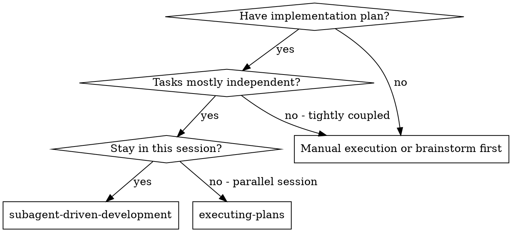
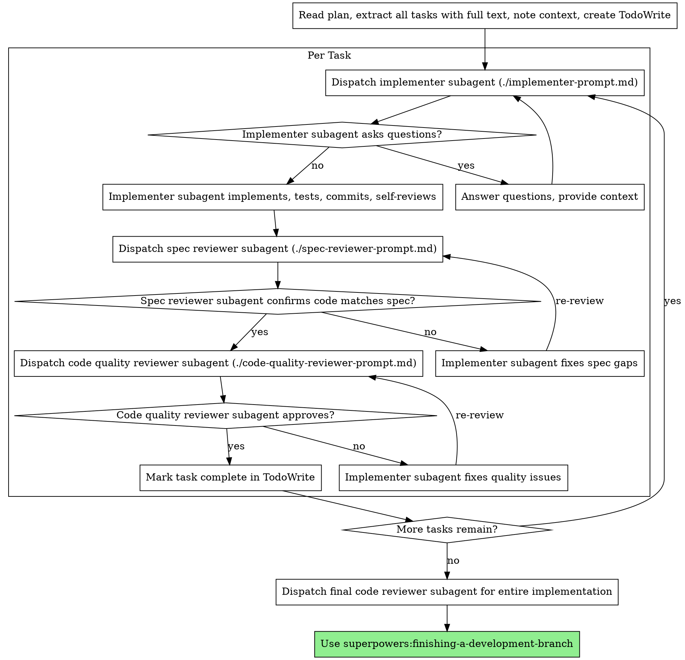

# Subagent-Driven Development

通过为每个 task 分派 fresh subagent 来执行计划，并在每个 task 后进行两阶段 review：先 spec compliance review，再 code quality review。

**Why subagents:** 你把 tasks 委派给带 isolated context 的 specialized agents。通过精确构造它们的 instructions 和 context，你能确保它们保持专注并完成 task。它们永远不应该继承你的 session context 或 history；你只构造它们真正需要的内容。这也会保留你自己的 context，用于协调工作。

**核心原则：** Fresh subagent per task + two-stage review（spec then quality）= high quality, fast iteration

**Continuous execution:** 不要在 tasks 之间暂停向 human partner check in。不中断地执行 plan 中的所有 tasks。停下来的唯一理由是：你无法解决的 BLOCKED status、确实阻止进展的 ambiguity，或所有 tasks 已完成。"Should I continue?" prompts 和 progress summaries 会浪费他们的时间：他们要求你执行计划，所以执行它。

## 何时使用



**vs. Executing Plans (parallel session):**
- Same session（没有 context switch）
- Fresh subagent per task（没有 context pollution）
- 每个 task 后两阶段 review：先 spec compliance，再 code quality
- 更快 iteration（tasks 之间不需要 human-in-loop）

## 流程



## Model Selection

使用能处理对应 role 的最低能力模型，以节省成本并提高速度。

**Mechanical implementation tasks**（isolated functions、clear specs、1-2 files）：使用 fast, cheap model。当 plan 足够明确时，大多数 implementation tasks 都是机械性的。

**Integration and judgment tasks**（multi-file coordination、pattern matching、debugging）：使用 standard model。

**Architecture, design, and review tasks**：使用可用的最强模型。

**Task complexity signals:**
- Touches 1-2 files with a complete spec → cheap model
- Touches multiple files with integration concerns → standard model
- Requires design judgment or broad codebase understanding → most capable model

## Handling Implementer Status

Implementer subagents 会报告四种 status 之一。分别这样处理：

**DONE:** 进入 spec compliance review。

**DONE_WITH_CONCERNS:** Implementer 完成了工作，但标记了疑虑。继续前阅读 concerns。如果 concerns 关于 correctness 或 scope，review 前先处理。如果只是 observations（例如 "this file is getting large"），记录下来并继续 review。

**NEEDS_CONTEXT:** Implementer 需要未提供的信息。补充 missing context 并重新 dispatch。

**BLOCKED:** Implementer 无法完成 task。评估 blocker：
1. 如果是 context problem，提供更多 context，并用同一 model 重新 dispatch
2. 如果 task 需要更多 reasoning，用更强模型重新 dispatch
3. 如果 task 太大，拆成更小 pieces
4. 如果 plan 本身错误，升级给 human

**Never** ignore an escalation or force the same model to retry without changes. 如果 implementer 说卡住了，就必须改变某些东西。

## Prompt Templates

- `./implementer-prompt.md` - Dispatch implementer subagent
- `./spec-reviewer-prompt.md` - Dispatch spec compliance reviewer subagent
- `./code-quality-reviewer-prompt.md` - Dispatch code quality reviewer subagent

## Example Workflow

```
You: I'm using Subagent-Driven Development to execute this plan.

[Read plan file once: docs/superpowers/plans/feature-plan.md]
[Extract all 5 tasks with full text and context]
[Create TodoWrite with all tasks]

Task 1: Hook installation script

[Get Task 1 text and context (already extracted)]
[Dispatch implementation subagent with full task text + context]

Implementer: "Before I begin - should the hook be installed at user or system level?"

You: "User level (~/.config/superpowers/hooks/)"

Implementer: "Got it. Implementing now..."
[Later] Implementer:
  - Implemented install-hook command
  - Added tests, 5/5 passing
  - Self-review: Found I missed --force flag, added it
  - Committed

[Dispatch spec compliance reviewer]
Spec reviewer: ✅ Spec compliant - all requirements met, nothing extra

[Get git SHAs, dispatch code quality reviewer]
Code reviewer: Strengths: Good test coverage, clean. Issues: None. Approved.

[Mark Task 1 complete]

Task 2: Recovery modes

[Get Task 2 text and context (already extracted)]
[Dispatch implementation subagent with full task text + context]

Implementer: [No questions, proceeds]
Implementer:
  - Added verify/repair modes
  - 8/8 tests passing
  - Self-review: All good
  - Committed

[Dispatch spec compliance reviewer]
Spec reviewer: ❌ Issues:
  - Missing: Progress reporting (spec says "report every 100 items")
  - Extra: Added --json flag (not requested)

[Implementer fixes issues]
Implementer: Removed --json flag, added progress reporting

[Spec reviewer reviews again]
Spec reviewer: ✅ Spec compliant now

[Dispatch code quality reviewer]
Code reviewer: Strengths: Solid. Issues (Important): Magic number (100)

[Implementer fixes]
Implementer: Extracted PROGRESS_INTERVAL constant

[Code reviewer reviews again]
Code reviewer: ✅ Approved

[Mark Task 2 complete]

...

[After all tasks]
[Dispatch final code-reviewer]
Final reviewer: All requirements met, ready to merge

Done!
```

## Advantages

**vs. Manual execution:**
- Subagents 自然遵循 TDD
- 每个 task 都是 fresh context（没有 confusion）
- Parallel-safe（subagents 不互相干扰）
- Subagent 可以提问（工作前和工作中都可以）

**vs. Executing Plans:**
- Same session（没有 handoff）
- Continuous progress（不用等待）
- Review checkpoints 自动发生

**Efficiency gains:**
- 没有 file reading overhead（controller 提供 full text）
- Controller 精确筛选所需 context
- Subagent 一开始就拿到完整信息
- 问题在工作开始前浮现（不是之后）

**Quality gates:**
- Self-review 在 handoff 前抓问题
- Two-stage review：spec compliance，然后 code quality
- Review loops 确保 fixes 真的工作
- Spec compliance 防止 over/under-building
- Code quality 确保 implementation well-built

**Cost:**
- 更多 subagent invocations（implementer + 每个 task 2 个 reviewers）
- Controller 做更多前置准备（预先提取所有 tasks）
- Review loops 增加 iterations
- 但能早抓问题（比之后 debugging 更便宜）

## Red Flags

**Never:**
- 未经用户明确同意就在 main/master branch 上开始 implementation
- 跳过 reviews（spec compliance 或 code quality）
- 带着未修复 issues 继续
- 并行 dispatch 多个 implementation subagents（会冲突）
- 让 subagent 读取 plan file（改为提供 full text）
- 跳过 scene-setting context（subagent 需要理解 task 放在哪里）
- 忽略 subagent questions（先回答，再让它们继续）
- 在 spec compliance 上接受 "close enough"（spec reviewer 发现 issues = not done）
- 跳过 review loops（reviewer 发现 issues = implementer fixes = review again）
- 用 implementer self-review 替代实际 review（两者都需要）
- **在 spec compliance ✅ 前开始 code quality review**（顺序错误）
- 任一 review 仍有 open issues 时移动到下一个 task

**If subagent asks questions:**
- 清楚、完整地回答
- 如有需要，提供 additional context
- 不要催它们进入 implementation

**If reviewer finds issues:**
- Implementer（同一个 subagent）修复它们
- Reviewer 再 review
- 重复直到 approved
- 不要跳过 re-review

**If subagent fails task:**
- 用具体指令 dispatch fix subagent
- 不要尝试手动修复（context pollution）

## Integration

**Required workflow skills:**
- **superpowers:using-git-worktrees** - 确保 isolated workspace（创建或验证已有）
- **superpowers:writing-plans** - 创建本 skill 执行的计划
- **superpowers:requesting-code-review** - reviewer subagents 使用的 code review template
- **superpowers:finishing-a-development-branch** - 所有 tasks 完成后收尾开发

**Subagents should use:**
- **superpowers:test-driven-development** - Subagents 对每个 task 遵循 TDD

**Alternative workflow:**
- **superpowers:executing-plans** - 用于 parallel session，而不是 same-session execution
