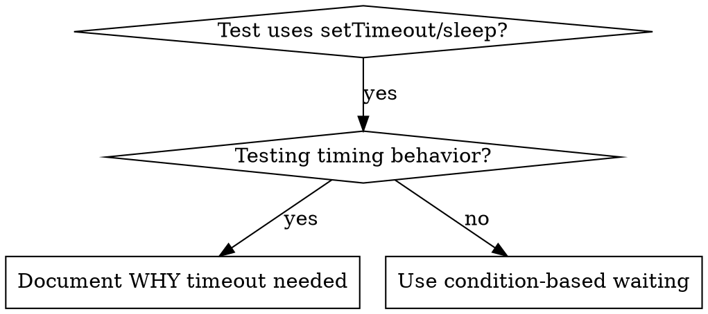

# Condition-Based Waiting

## 概览

Flaky tests 经常用 arbitrary delays 猜 timing。这会制造 race conditions：tests 在快机器上通过，但在 load 或 CI 下失败。

**核心原则：** 等你真正关心的 actual condition，而不是猜它需要多久。

## 何时使用



**Use when:**
- Tests 有 arbitrary delays（`setTimeout`、`sleep`、`time.sleep()`）
- Tests flaky（有时 pass，在 load 下 fail）
- Tests parallel 运行时 timeout
- 等待 async operations complete

**Don't use when:**
- 测试实际 timing behavior（debounce、throttle intervals）
- 如果使用 arbitrary timeout，始终 document WHY

## Core Pattern

```typescript
// ❌ BEFORE: Guessing at timing
await new Promise(r => setTimeout(r, 50));
const result = getResult();
expect(result).toBeDefined();

// ✅ AFTER: Waiting for condition
await waitFor(() => getResult() !== undefined);
const result = getResult();
expect(result).toBeDefined();
```

## Quick Patterns

| Scenario | Pattern |
|----------|---------|
| Wait for event | `waitFor(() => events.find(e => e.type === 'DONE'))` |
| Wait for state | `waitFor(() => machine.state === 'ready')` |
| Wait for count | `waitFor(() => items.length >= 5)` |
| Wait for file | `waitFor(() => fs.existsSync(path))` |
| Complex condition | `waitFor(() => obj.ready && obj.value > 10)` |

## Implementation

Generic polling function:
```typescript
async function waitFor<T>(
  condition: () => T | undefined | null | false,
  description: string,
  timeoutMs = 5000
): Promise<T> {
  const startTime = Date.now();

  while (true) {
    const result = condition();
    if (result) return result;

    if (Date.now() - startTime > timeoutMs) {
      throw new Error(`Timeout waiting for ${description} after ${timeoutMs}ms`);
    }

    await new Promise(r => setTimeout(r, 10)); // Poll every 10ms
  }
}
```

完整 implementation 见本目录的 `condition-based-waiting-example.ts`，其中包含 actual debugging session 中的 domain-specific helpers（`waitForEvent`、`waitForEventCount`、`waitForEventMatch`）。

## 常见错误

**❌ Polling too fast:** `setTimeout(check, 1)` - 浪费 CPU
**✅ Fix:** 每 10ms poll 一次

**❌ No timeout:** 如果 condition 永远不满足，会无限 loop
**✅ Fix:** 始终包含 timeout 和 clear error

**❌ Stale data:** 在 loop 前 cache state
**✅ Fix:** 在 loop 内调用 getter 获取 fresh data

## When Arbitrary Timeout IS Correct

```typescript
// Tool ticks every 100ms - need 2 ticks to verify partial output
await waitForEvent(manager, 'TOOL_STARTED'); // First: wait for condition
await new Promise(r => setTimeout(r, 200));   // Then: wait for timed behavior
// 200ms = 2 ticks at 100ms intervals - documented and justified
```

**Requirements:**
1. 先 wait for triggering condition
2. 基于 known timing（不是 guessing）
3. Comment explaining WHY

## Real-World Impact

来自 debugging session（2025-10-03）：
- 修复 3 个文件中的 15 个 flaky tests
- Pass rate: 60% → 100%
- Execution time: 快 40%
- 不再有 race conditions
