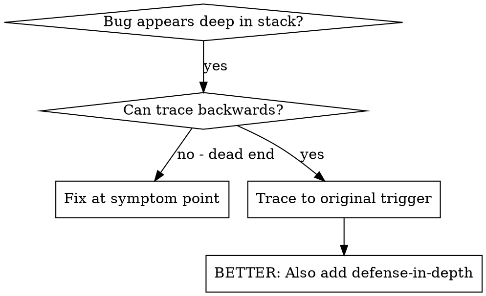
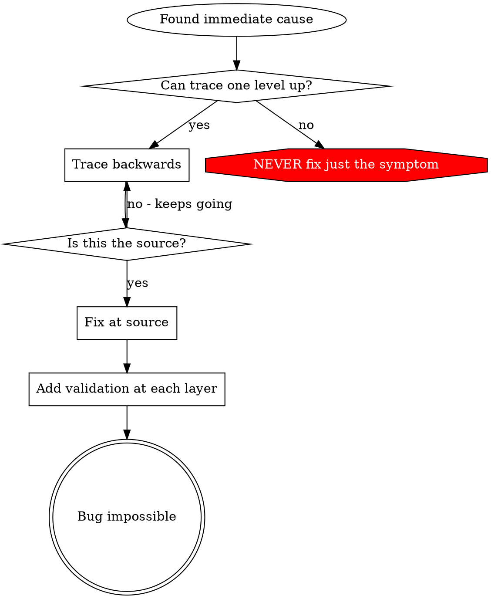

# Root Cause Tracing

## 概览

Bugs 经常在 call stack 深处表现出来（git init 在错误目录、file 创建在错误位置、database 用错误 path 打开）。你的本能是在 error 出现的位置修复，但那是在治疗 symptom。

**核心原则：** 沿 call chain 向后追踪，直到找到 original trigger，然后在 source 修复。

## 何时使用



**Use when:**
- Error 发生在 execution 深处（不是 entry point）
- Stack trace 显示长 call chain
- 不清楚 invalid data 从哪里来
- 需要找出哪个 test/code 触发问题

## Tracing Process

### 1. Observe the Symptom
```
Error: git init failed in ~/project/packages/core
```

### 2. Find Immediate Cause
**哪段 code 直接导致这个问题？**
```typescript
await execFileAsync('git', ['init'], { cwd: projectDir });
```

### 3. Ask: What Called This?
```typescript
WorktreeManager.createSessionWorktree(projectDir, sessionId)
  → called by Session.initializeWorkspace()
  → called by Session.create()
  → called by test at Project.create()
```

### 4. Keep Tracing Up
**传入了什么 value？**
- `projectDir = ''`（empty string!）
- Empty string 作为 `cwd` 会解析成 `process.cwd()`
- 那就是 source code directory!

### 5. Find Original Trigger
**Empty string 从哪里来？**
```typescript
const context = setupCoreTest(); // Returns { tempDir: '' }
Project.create('name', context.tempDir); // Accessed before beforeEach!
```

## Adding Stack Traces

当你无法手动追踪时，添加 instrumentation：

```typescript
// Before the problematic operation
async function gitInit(directory: string) {
  const stack = new Error().stack;
  console.error('DEBUG git init:', {
    directory,
    cwd: process.cwd(),
    nodeEnv: process.env.NODE_ENV,
    stack,
  });

  await execFileAsync('git', ['init'], { cwd: directory });
}
```

**Critical:** 在 tests 中使用 `console.error()`（不要用 logger，可能不显示）

**Run and capture:**
```bash
npm test 2>&1 | grep 'DEBUG git init'
```

**Analyze stack traces:**
- 寻找 test file names
- 找到触发 call 的 line number
- 识别 pattern（同一个 test？同一个 parameter？）

## Finding Which Test Causes Pollution

如果某个东西在 tests 期间出现，但你不知道是哪个 test：

使用本目录的 bisection script `find-polluter.sh`：

```bash
./find-polluter.sh '.git' 'src/**/*.test.ts'
```

它会逐个运行 tests，并在第一个 polluter 处停止。Usage 见 script。

## Real Example: Empty projectDir

**Symptom:** `.git` 创建在 `packages/core/`（source code）

**Trace chain:**
1. `git init` 在 `process.cwd()` 中运行 ← empty cwd parameter
2. WorktreeManager 被传入 empty projectDir
3. Session.create() 被传入 empty string
4. Test 在 beforeEach 前访问了 `context.tempDir`
5. setupCoreTest() 初始返回 `{ tempDir: '' }`

**Root cause:** Top-level variable initialization 访问了 empty value

**Fix:** 把 tempDir 做成 getter，如果 before beforeEach 访问就 throw

**Also added defense-in-depth:**
- Layer 1: Project.create() validates directory
- Layer 2: WorkspaceManager validates not empty
- Layer 3: NODE_ENV guard refuses git init outside tmpdir
- Layer 4: Stack trace logging before git init

## Key Principle



**永远不要只修 error 出现的位置。** 追溯回去，找到 original trigger。

## Stack Trace Tips

**In tests:** 使用 `console.error()`，不要用 logger，因为 logger 可能被 suppress
**Before operation:** 在危险 operation 前 log，不要在失败后 log
**Include context:** Directory、cwd、environment variables、timestamps
**Capture stack:** `new Error().stack` 显示完整 call chain

## Real-World Impact

来自 debugging session（2025-10-03）：
- 通过 5-level trace 找到 root cause
- 在 source 修复（getter validation）
- 添加 4 层 defense
- 1847 tests passed，zero pollution
