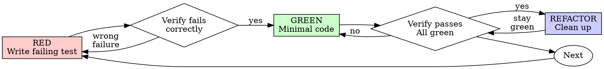

# Test-Driven Development (TDD)

## 概览

先写测试。看它失败。写最少代码让它通过。

**核心原则：** 如果你没有亲眼看到 test fail，你就不知道它是否测试了正确的东西。

**违反规则的字面要求，就是违反规则的精神。**

## 何时使用

**Always:**
- New features
- Bug fixes
- Refactoring
- Behavior changes

**Exceptions（询问你的 human partner）：**
- Throwaway prototypes
- Generated code
- Configuration files

正在想 "skip TDD just this once"？停下。这是在合理化逃避。

## 铁律

```
NO PRODUCTION CODE WITHOUT A FAILING TEST FIRST
```

先写了 code 再写 test？删除它。重新开始。

**No exceptions:**
- 不要把它留作 "reference"
- 不要在写 tests 时 "adapt" 它
- 不要看它
- Delete means delete

从 tests 重新实现。句号。

## Red-Green-Refactor



### RED - Write Failing Test

写一个最小 test，展示应该发生什么。

<Good>
```typescript
test('retries failed operations 3 times', async () => {
  let attempts = 0;
  const operation = () => {
    attempts++;
    if (attempts < 3) throw new Error('fail');
    return 'success';
  };

  const result = await retryOperation(operation);

  expect(result).toBe('success');
  expect(attempts).toBe(3);
});
```
名称清楚，测试真实 behavior，只测一件事
</Good>

<Bad>
```typescript
test('retry works', async () => {
  const mock = jest.fn()
    .mockRejectedValueOnce(new Error())
    .mockRejectedValueOnce(new Error())
    .mockResolvedValueOnce('success');
  await retryOperation(mock);
  expect(mock).toHaveBeenCalledTimes(3);
});
```
名称含糊，测的是 mock 而不是 code
</Bad>

**Requirements:**
- One behavior
- Clear name
- Real code（除非无法避免，否则不用 mocks）

### Verify RED - Watch It Fail

**MANDATORY。永远不要跳过。**

```bash
npm test path/to/test.test.ts
```

确认：
- Test fails（不是 errors）
- Failure message 是预期的
- 因 feature missing 失败（不是 typo）

**Test passes?** 你在测试已有 behavior。修 test。

**Test errors?** 修 error，重新运行，直到它正确失败。

### GREEN - Minimal Code

写最简单的 code，让 test 通过。

<Good>
```typescript
async function retryOperation<T>(fn: () => Promise<T>): Promise<T> {
  for (let i = 0; i < 3; i++) {
    try {
      return await fn();
    } catch (e) {
      if (i === 2) throw e;
    }
  }
  throw new Error('unreachable');
}
```
Just enough to pass
</Good>

<Bad>
```typescript
async function retryOperation<T>(
  fn: () => Promise<T>,
  options?: {
    maxRetries?: number;
    backoff?: 'linear' | 'exponential';
    onRetry?: (attempt: number) => void;
  }
): Promise<T> {
  // YAGNI
}
```
Over-engineered
</Bad>

不要添加 features、refactor 其他代码，或在 test 之外“改进”。

### Verify GREEN - Watch It Pass

**MANDATORY。**

```bash
npm test path/to/test.test.ts
```

确认：
- Test passes
- 其他 tests 仍然 pass
- Output pristine（没有 errors、warnings）

**Test fails?** 修 code，不要修 test。

**Other tests fail?** 现在就修。

### REFACTOR - Clean Up

只有 green 之后才做：
- Remove duplication
- Improve names
- Extract helpers

保持 tests green。不要添加 behavior。

### Repeat

为下一个 feature 写下一个 failing test。

## Good Tests

| Quality | Good | Bad |
|---------|------|-----|
| **Minimal** | One thing。name 里有 "and"？拆开。 | `test('validates email and domain and whitespace')` |
| **Clear** | Name 描述 behavior | `test('test1')` |
| **Shows intent** | 展示期望 API | 掩盖 code 应该做什么 |

## 为什么顺序重要

**"I'll write tests after to verify it works"**

Code 之后写的 tests 会立刻通过。立刻通过什么都证明不了：
- 可能测试了错误的东西
- 可能测试 implementation，而不是 behavior
- 可能漏掉你忘记的 edge cases
- 你从没看到它抓住 bug

Test-first 强制你看到 test fail，证明它确实测试了某个东西。

**"I already manually tested all the edge cases"**

Manual testing 是 ad-hoc。你以为自己测了所有东西，但：
- 没有你测过什么的记录
- code 变化后无法重新运行
- 压力下很容易忘记 cases
- "It worked when I tried it" ≠ comprehensive

Automated tests 是 systematic。每次都以同样方式运行。

**"Deleting X hours of work is wasteful"**

Sunk cost fallacy。时间已经花掉了。你现在的选择是：
- 删除并用 TDD 重写（再花 X 小时，高信心）
- 保留它并事后补 tests（30 分钟，低信心，很可能有 bugs）

真正的 "waste" 是保留你无法信任的代码。没有真实 tests 的 working code 是 technical debt。

**"TDD is dogmatic, being pragmatic means adapting"**

TDD 就是 pragmatic：
- commit 前发现 bugs（比之后 debugging 更快）
- 防止 regressions（tests 会立即抓住 breaks）
- 记录 behavior（tests 展示如何使用 code）
- 支持 refactoring（自由修改，tests 抓住 breaks）

"Pragmatic" shortcuts = production 里 debugging = 更慢。

**"Tests after achieve the same goals - it's spirit not ritual"**

不。Tests-after 回答 "What does this do?" Tests-first 回答 "What should this do?"

Tests-after 会被你的 implementation 带偏。你测试自己构建了什么，而不是 requirements 是什么。你验证记得的 edge cases，不是发现出来的 edge cases。

Tests-first 强制在实现前发现 edge cases。Tests-after 验证你是否记住了一切（你没有）。

事后写 30 分钟 tests ≠ TDD。你得到 coverage，但失去 tests 确实工作的证明。

## 常见合理化借口

| Excuse | Reality |
|--------|---------|
| "Too simple to test" | Simple code breaks。Test 只要 30 秒。 |
| "I'll test after" | Tests passing immediately prove nothing。 |
| "Tests after achieve same goals" | Tests-after = "what does this do?" Tests-first = "what should this do?" |
| "Already manually tested" | Ad-hoc ≠ systematic。没有记录，无法 re-run。 |
| "Deleting X hours is wasteful" | Sunk cost fallacy。保留未验证代码是 technical debt。 |
| "Keep as reference, write tests first" | 你会 adapt 它。那就是 testing after。Delete means delete。 |
| "Need to explore first" | 可以。扔掉 exploration，用 TDD 开始。 |
| "Test hard = design unclear" | 听 test 的。Hard to test = hard to use。 |
| "TDD will slow me down" | TDD 比 debugging 更快。Pragmatic = test-first。 |
| "Manual test faster" | Manual 无法证明 edge cases。每次变化都要重新测。 |
| "Existing code has no tests" | 你在改进它。为 existing code 添加 tests。 |

## Red Flags - STOP and Start Over

- Code before test
- Test after implementation
- Test passes immediately
- 无法解释 test 为什么 failed
- Tests added "later"
- Rationalizing "just this once"
- "I already manually tested it"
- "Tests after achieve the same purpose"
- "It's about spirit not ritual"
- "Keep as reference" 或 "adapt existing code"
- "Already spent X hours, deleting is wasteful"
- "TDD is dogmatic, I'm being pragmatic"
- "This is different because..."

**所有这些都意味着：Delete code。Start over with TDD。**

## Example: Bug Fix

**Bug:** Empty email accepted

**RED**
```typescript
test('rejects empty email', async () => {
  const result = await submitForm({ email: '' });
  expect(result.error).toBe('Email required');
});
```

**Verify RED**
```bash
$ npm test
FAIL: expected 'Email required', got undefined
```

**GREEN**
```typescript
function submitForm(data: FormData) {
  if (!data.email?.trim()) {
    return { error: 'Email required' };
  }
  // ...
}
```

**Verify GREEN**
```bash
$ npm test
PASS
```

**REFACTOR**
如果需要，提取 multiple fields 的 validation。

## Verification Checklist

标记 work complete 前：

- [ ] 每个 new function/method 都有 test
- [ ] 实现前亲眼看到每个 test fail
- [ ] 每个 test 都因预期原因 fail（feature missing，不是 typo）
- [ ] 写了最少代码让每个 test pass
- [ ] All tests pass
- [ ] Output pristine（没有 errors、warnings）
- [ ] Tests 使用 real code（只有无法避免时才用 mocks）
- [ ] 覆盖 edge cases 和 errors

不能勾选所有项？你跳过了 TDD。重新开始。

## When Stuck

| Problem | Solution |
|---------|----------|
| Don't know how to test | 写 wished-for API。先写 assertion。问你的 human partner。 |
| Test too complicated | Design too complicated。简化 interface。 |
| Must mock everything | Code too coupled。使用 dependency injection。 |
| Test setup huge | Extract helpers。仍然复杂？简化 design。 |

## Debugging Integration

发现 bug？写一个 reproducing 它的 failing test。遵循 TDD cycle。Test 会证明 fix 并防止 regression。

永远不要在没有 test 的情况下修 bugs。

## Testing Anti-Patterns

添加 mocks 或 test utilities 时，阅读 @testing-anti-patterns.md 以避免常见陷阱：
- 测试 mock behavior，而不是真实 behavior
- 给 production classes 添加 test-only methods
- 不理解 dependencies 就 mock

## Final Rule

```
Production code → test exists and failed first
Otherwise → not TDD
```

没有你的 human partner 许可，不存在 exceptions。
