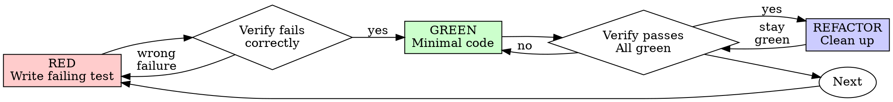

# 测试驱动开发 (TDD)

## Overview

先写测试。看着它失败。编写最少的代码即可通过。

**核心原则：** 如果你没有看到测试失败，你就不知道它是否测试了正确的东西。

**违反规则的字面意思就是违反规则的精神。**

## When to Use

**Always:**
- New features
- Bug fixes
- Refactoring
- Behavior changes

**例外（询问你的人类伙伴）：**
- Throwaway prototypes
- Generated code
- Configuration files

想"跳过 TDD 这一次"吗？停止。这就是合理化。

## The Iron Law

```
NO PRODUCTION CODE WITHOUT A FAILING TEST FIRST
```

测试前先写代码？删除它。重新开始。

**No exceptions:**
- 不要将其保留为"参考"
- 编写测试时不要"适应"它
- 别看它
- 删除就是删除

实施新的测试。时期。

## Red-Green-Refactor


```dot
digraph tdd_cycle {
    rankdir=LR;
    red [label="RED\nWrite failing test", shape=box, style=filled, fillcolor="#ffcccc"];
    verify_red [label="Verify fails\ncorrectly", shape=diamond];
    green [label="GREEN\nMinimal code", shape=box, style=filled, fillcolor="#ccffcc"];
    verify_green [label="Verify passes\nAll green", shape=diamond];
    refactor [label="REFACTOR\nClean up", shape=box, style=filled, fillcolor="#ccccff"];
    next [label="Next", shape=ellipse];

    red -> verify_red;
    verify_red -> green [label="yes"];
    verify_red -> red [label="wrong\nfailure"];
    green -> verify_green;
    verify_green -> refactor [label="yes"];
    verify_green -> green [label="no"];
    refactor -> verify_green [label="stay\ngreen"];
    verify_green -> next;
    next -> red;
}
```

### RED - Write Failing Test

编写一个最小的测试来显示应该发生什么。

<Good>
```typescript
test('retries failed operations 3 times', async () => {
  let attempts = 0;
  const operation = () => {
    attempts++;
    if (attempts < 3) throw new Error('fail');
    return 'success';
  };

  const result = await retryOperation(operation);

  expect(result).toBe('success');
  expect(attempts).toBe(3);
});
```
清晰的名字，测试真实的行为，一件事
</Good>

<Bad>
```typescript
test('retry works', async () => {
  const mock = jest.fn()
    .mockRejectedValueOnce(new Error())
    .mockRejectedValueOnce(new Error())
    .mockResolvedValueOnce('success');
  await retryOperation(mock);
  expect(mock).toHaveBeenCalledTimes(3);
});
```
模糊的名称，测试模拟而不是代码
</Bad>

**Requirements:**
- One behavior
- Clear name
- 真实代码（除非不可避免，否则不进行模拟）

### Verify RED - Watch It Fail

**强制。切勿跳过。**

```bash
npm test path/to/test.test.ts
```

Confirm:
- 测试失败（不是错误）
- 预计会出现失败消息
- 由于功能缺失（不是拼写错误）而失败

**测试通过？** 您正在测试现有行为。修复测试。

**测试错误？** 修复错误，重新运行，直到正确失败。

### GREEN - Minimal Code

编写最简单的代码来通过测试。

<Good>
```typescript
async function retryOperation<T>(fn: () => Promise<T>): Promise<T> {
  for (let i = 0; i < 3; i++) {
    try {
      return await fn();
    } catch (e) {
      if (i === 2) throw e;
    }
  }
  throw new Error('unreachable');
}
```
只要够通过即可
</Good>

<Bad>
```typescript
async function retryOperation<T>(
  fn: () => Promise<T>,
  options?: {
    maxRetries?: number;
    backoff?: 'linear' | 'exponential';
    onRetry?: (attempt: number) => void;
  }
): Promise<T> {
  // YAGNI
}
```
Over-engineered
</Bad>

不要添加功能、重构其他代码或在测试之外进行"改进"。

### Verify GREEN - Watch It Pass

**MANDATORY.**

```bash
npm test path/to/test.test.ts
```

Confirm:
- Test passes
- 其他测试仍然通过
- 输出原始（没有错误、警告）

**测试失败？** 修复代码，而不是测试。

**其他测试失败？** 立即修复。

### REFACTOR - Clean Up

仅绿色之后：
- Remove duplication
- Improve names
- Extract helpers

保持测试绿色。不要添加行为。

### Repeat

下一个功能的下一个失败测试。

## Good Tests

|品质 |好 |坏|
|---------|------|-----|
| **最小** |一件事。名字中的"和"？分开它。 | `test('validates email and domain and whitespace')` |
| **清除** |名称描述行为 | `test('test1')` |
| **表明意图** |演示所需的 API |模糊了代码应该做什么 |

编写或修改任何测试时，请阅读 [writing-good-tests.md](writing-good-tests.md)，遵循其中保证测试诚实有效的规则：
- 写测试前先说清哪一种 production change 会让它失败
- 断言真实行为，绝不把 mock 行为当成被测结果
- 仅供测试使用的代码放在 test utilities，而不是 production classes
- Mock dependency 前先理解它的全部 side effects

## Common Rationalizations

| 借口 | 事实 |
|------|------|
| “太简单了，不用测试” | 简单代码也会坏。测试只需 30 秒。 |
| “之后再补测试” | 实现后写的测试会立即通过，这什么也证明不了。它可能测错对象、测实现而不是行为，或漏掉你忘记的边界情况。你没见过它失败，就没证明它能抓住 bug；test-first 强制给出这份证据。 |
| “事后测试也能达到同样目标，重要的是精神而不是仪式” | Tests-after 回答“它做了什么”；tests-first 回答“它应该做什么”。事后测试会被现有实现带偏，只验证你记得的 cases，而不是提前发现的 cases。那只是 coverage，没有测试有效性的证明。 |
| “已经手动测试过” | 手动测试是临时的：没有覆盖记录，变更后无法重跑，压力下很容易漏项。“我试过能用”不等于全面；自动化测试每次都会按同样方式执行。 |
| “删掉 X 小时的工作太浪费” | 沉没成本已经发生。真正的选择是：用 TDD 重写并获得高可信度，或保留代码再补测试并承担低可信度与潜在 bug。保留无法信任的代码才是浪费。 |
| “留作参考，再先写测试” | 你会不自觉地适配它，这仍然是 tests-after。删除就是删除。 |
| “需要先探索” | 可以。丢弃探索代码，再从 TDD 开始。 |
| “很难测试，说明测试不适用” | 听测试的反馈。难以测试通常意味着难以使用。 |
| “TDD 会拖慢我” | TDD 才是务实路径：提交前抓 bug、防回归，并允许放心重构。所谓“务实”捷径会把调试推到生产环境，反而更慢。 |
| “手动测试更快” | 手动测试不能证明边界情况，而且每次改动都要重测。 |
| “现有代码没有测试” | 你正在改善它。为现有代码补上测试。 |

## Red Flags - STOP and Start Over

- 测试前的代码
- 实施后测试
- 测试立即通过
- 无法解释测试失败的原因
- "稍后"添加测试
- 合理化"就这一次"
- "我已经手动测试过了"
- "达到相同目的后进行测试"
- "这是关于精神而不是仪式"
- "保留作为参考"或"改编现有代码"
- "已经花了X个小时了，删除太浪费了"
- "TDD 很教条，我很务实"
- "这是不同的，因为……"

**所有这些意味着：删除代码。从 TDD 开始。**

## Example: Bug Fix

**错误：** 接受空电子邮件

**RED**
```typescript
test('rejects empty email', async () => {
  const result = await submitForm({ email: '' });
  expect(result.error).toBe('Email required');
});
```

**Verify RED**
```bash
$ npm test
FAIL: expected 'Email required', got undefined
```

**GREEN**
```typescript
function submitForm(data: FormData) {
  if (!data.email?.trim()) {
    return { error: 'Email required' };
  }
  // ...
}
```

**Verify GREEN**
```bash
$ npm test
PASS
```

**REFACTOR**
如果需要，提取多个字段的验证。

## Verification Checklist

在标记工作完成之前：

- [ ] 每个新函数/method都有一个测试
- [ ] 在实施之前观察每个测试的失败
- [ ] 每个测试均因预期原因而失败（功能缺失，而非拼写错误）
- [ ] 编写最少的代码来通过每个测试
- [ ] 所有测试均通过
- [ ] 输出原始（没有错误、警告）
- [ ] 测试使用真实代码（仅在不可避免时才进行模拟）
- [ ] 涵盖的边缘情况和错误

无法选中所有框吗？你跳过了 TDD。重新开始。

## When Stuck

|问题 |解决方案 |
|---------|----------|
|不知道如何测试 |编写想要的 API。先写断言。询问你的人类伙伴。 |
|测试太复杂|设计太复杂了。简化界面。 |
|必须嘲笑一切|代码耦合性太强。使用依赖注入。 |
|测试设置巨大|提取助手。还是很复杂？简化设计。 |

## Debugging Integration

发现错误了吗？编写失败的测试来重现它。遵循 TDD 周期。测试证明可以修复并防止回归。

未经测试切勿修复错误。

## Final Rule

```
Production code → test exists and failed first
Otherwise → not TDD
```

未经您的人类伴侣许可，也不例外。
