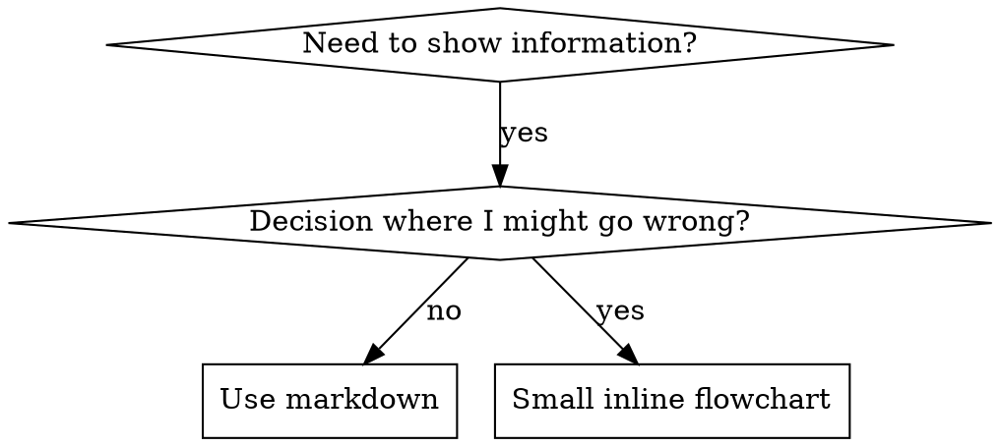

# Writing Skills

## Overview

**写作技巧是将测试驱动开发应用于流程文档。**

**个人技能位于运行时的技能目录中** — 请参阅 [claude-code-tools.md](../using-superpowers/references/claude-code-tools.md)、[codex-tools.md](../using-superpowers/references/codex-tools.md)、[copilot-tools.md](../using-superpowers/references/copilot-tools.md) 或 [gemini-tools.md](../using-superpowers/references/gemini-tools.md) 了解运行时的路径。 Codex、Copilot CLI 和 Gemini CLI 也都将 `~/.agents/skills/` 识别为跨运行时别名。

您编写测试用例（子代理的压力场景），观察它们失败（基线行为），编写技能（文档），观察测试通过（代理遵守），然后重构（关闭漏洞）。

**核心原则：** 如果你没有看到代理在没有技能的情况下失败，你就不知道该技能是否教授了正确的东西。

**所需背景：** 在使用此技能之前，您必须了解超能力：测试驱动开发。该技能定义了基本的红-绿-重构循环。该技能使 TDD 适应文档。

**官方指导：** Anthropic 官方技能创作最佳实践，请参见anthropic-best-practices.md。本文档提供了额外的模式和指南，以补充该技能中以 TDD 为中心的方法。

## 什么是技能？

**技能**是经过验证的技术、模式或工具的参考指南。技能帮助未来的代理人找到并应用有效的方法。

**技能是：** 可重复使用的技术、模式、工具、参考指南

**技能不是：** 关于您如何解决一次问题的叙述

## Skills 的 TDD 映射

| TDD 概念 |技能创造|
|-------------|----------------|
| **测试用例** |带有子代理的压力场景 |
| **生产代码** |技能文档 (SKILL.md) |
| **测试失败（红色）** |代理在没有技能的情况下违反规则（基线）|
| **测试通过（绿色）** |代理人遵守现有技能 |
| **重构** |堵住漏洞，同时保持合规性 |
| **先写测试** |在编写技能之前运行基线场景 |
| **看着它失败** |记录代理使用的准确合理化|
| **最少代码** |编写解决这些特定违规行为的技能 |
| **看着它过去** |验证代理现在是否符合要求 |
| **重构周期** |寻找新的合理化→堵塞→重新验证|

整个技能创建过程遵循红-绿-重构。

## 何时创建 Skill

**Create when:**
- 技术对你来说并不直观明显
- 您可以在项目中再次引用它
- 模式适用范围广泛（不特定于项目）
- 其他人会受益

**不要为以下目的创建：**
- One-off solutions
- 其他地方有详细记录的标准实践
- 项目特定约定（放入您的说明文件中）
- 机械约束（如果可以使用正则表达式 /validation 强制执行，则将其自动化 - 保存判断调用的文档）

## Skill Types

### Technique
具体方法和步骤（基于条件的等待、根本原因追踪）

### Pattern
思考问题的方式（带标志的扁平化、测试不变量）

### Reference
API文档、语法指南、工具文档（office文档）

## Directory Structure


```
skills/
  skill-name/
    SKILL.md              # Main reference (required)
    supporting-file.*     # Only if needed
```

**扁平命名空间** - 所有技能都集中在一个可搜索命名空间中

**单独的文件：**
1. **大量参考**（100 多行）- API 文档，全面的语法
2. **可重用工具** - 脚本、实用程序、模板

**Keep inline:**
- 原理和概念
- 代码模式（< 50 行）
- Everything else

## SKILL.md Structure

**Frontmatter (YAML):**
- 两个必填字段：`name` 和 `description`（请参阅 [agentskills.io/specification](https://agentskills.io/specification) 了解所有支持的字段）
- 总共最多 1024 个字符
- `name`：仅使用字母、数字和连字符（无括号、特殊字符）
- `description`：第三人称，仅描述何时使用（而不是它的作用）
  - 从"Use when..."开始，重点关注触发条件
  - 包括具体症状、情况和背景
  - **永远不要总结技能的流程或工作流程**（请参阅 SDO 部分了解原因）
  - 尽可能保持在 500 个字符以内

```markdown
---
name: Skill-Name-With-Hyphens
description: Use when [specific triggering conditions and symptoms]
---

# Skill Name

## Overview
What is this? Core principle in 1-2 sentences.

## When to Use
[Small inline flowchart IF decision non-obvious]

Bullet list with SYMPTOMS and use cases
When NOT to use

## Core Pattern (for techniques/patterns)
Before/after code comparison

## Quick Reference
Table or bullets for scanning common operations

## Implementation
Inline code for simple patterns
Link to file for heavy reference or reusable tools

## Common Mistakes
What goes wrong + fixes

## Real-World Impact (optional)
Concrete results
```


## 技能发现优化 (SDO)

**发现的关键：**未来的特工需要找到你的技能

### 1. 丰富的 Description 字段

**目的：** 您的代理会阅读描述来决定为给定任务加载哪些技能。让它回答："我现在应该读这个技能吗？"

**格式：** 以"Use when..."开头，重点关注触发条件

**关键：描述=何时使用，而不是技能的作用**

描述应仅描述触发条件。不要在描述中总结技能的流程或工作流程。

**为什么这很重要：** 测试表明，当描述总结了技能的工作流程时，代理可能会遵循描述，而不是阅读完整的技能内容。尽管该技能的流程图清楚地显示了两次审查（规范合规性然后是代码质量），但"任务之间的代码审查"的描述导致代理进行一次审查。

当描述更改为"在执行具有独立任务的实施计划时使用"（无工作流程摘要）时，代理正确读取流程图并遵循两阶段审核流程。

**陷阱：** 总结工作流程的描述创建了代理将采取的快捷方式。技能体成为文档代理跳过。

```yaml
# ❌ BAD: Summarizes workflow - agents may follow this instead of reading skill
description: Use when executing plans - dispatches subagent per task with code review between tasks

# ❌ BAD: Too much process detail
description: Use for TDD - write test first, watch it fail, write minimal code, refactor

# ✅ GOOD: Just triggering conditions, no workflow summary
description: Use when executing implementation plans with independent tasks in the current session

# ✅ GOOD: Triggering conditions only
description: Use when implementing any feature or bugfix, before writing implementation code
```

**Content:**
- 使用表明该技能适用的具体触发因素、症状和情况
- 描述*问题*（竞争条件、不一致的行为）而不是*特定于语言的症状*（setTimeout、睡眠）
- 保持触发器与技术无关，除非技能本身是特定于技术的
- 如果技能是特定于技术的，请在触发器中明确说明
- 以第三人称书写（注入系统提示符）
- **永远不要总结技能的流程或工作流程**

```yaml
# ❌ BAD: Too abstract, vague, doesn't include when to use
description: For async testing

# ❌ BAD: First person
description: I can help you with async tests when they're flaky

# ❌ BAD: Mentions technology but skill isn't specific to it
description: Use when tests use setTimeout/sleep and are flaky

# ✅ GOOD: Starts with "Use when", describes problem, no workflow
description: Use when tests have race conditions, timing dependencies, or pass/fail inconsistently

# ✅ GOOD: Technology-specific skill with explicit trigger
description: Use when using React Router and handling authentication redirects
```

### 2. Keyword Coverage

使用客服人员会搜索的词语：
- 错误消息："挂钩超时"、"ENOTEMPTY"、"竞争条件"
- 症状："片状"、"悬挂"、"僵尸"、"污染"
- 同义词："超时/hang/freeze"、"清理/teardown/afterEach"
- 工具：实际命令、库名称、文件类型

### 3. Descriptive Naming

**使用主动语态，动词在前：**
- ✅ `creating-skills` 不是 `skill-creation`
- ✅ `condition-based-waiting` 不是 `async-test-helpers`

### 4. 代币效率（关键）

**问题：**每次对话中都会包含入门和经常引用的技能。每个令牌都很重要。

**目标字数：**
- 入门工作流程：每个 <150 字
- 常用技能：总字数<200
- 其他技能：<500字（仍要简洁）

**Techniques:**

**将详细信息移至工具帮助：**
```bash
# ❌ BAD: Document all flags in SKILL.md
search-conversations supports --text, --both, --after DATE, --before DATE, --limit N

# ✅ GOOD: Reference --help
search-conversations supports multiple modes and filters. Run --help for details.
```

**Use cross-references:**
```markdown
# ❌ BAD: Repeat workflow details
When searching, dispatch subagent with template...
[20 lines of repeated instructions]

# ✅ GOOD: Reference other skill
Always use subagents (50-100x context savings). REQUIRED: Use [other-skill-name] for workflow.
```

**Compress examples:**
```markdown
# ❌ BAD: Verbose example (42 words)
your human partner: "How did we handle authentication errors in React Router before?"
You: I'll search past conversations for React Router authentication patterns.
[Dispatch subagent with search query: "React Router authentication error handling 401"]

# ✅ GOOD: Minimal example (20 words)
Partner: "How did we handle auth errors in React Router?"
You: Searching...
[Dispatch subagent → synthesis]
```

**Eliminate redundancy:**
- 不要重复交叉引用技能中的内容
- 不要解释从命令中显而易见的内容
- 请勿包含同一模式的多个示例

**Verification:**
```bash
wc -w skills/path/SKILL.md
# getting-started workflows: aim for <150 each
# Other frequently-loaded: aim for <200 total
```

**根据您所做的事情或核心见解来命名：**
- ✅ `condition-based-waiting` > `async-test-helpers`
- ✅ `using-skills` 不是 `skill-usage`
- ✅ `flatten-with-flags` > `data-structure-refactoring`
- ✅ `root-cause-tracing` > `debugging-techniques`

**动名词 (-ing) 适用于流程：**
- `creating-skills`、`testing-skills`、`debugging-with-logs`
- 活跃，描述您正在采取的行动

### 5. 交叉引用其他 Skills

**在编写引用其他技能的文档时：**

仅使用技能名称，并带有明确的要求标记：
- ✅ 好：`**REQUIRED SUB-SKILL:** Use superpowers:test-driven-development`
- ✅ 好：`**REQUIRED BACKGROUND:** You MUST understand superpowers:systematic-debugging`
- ❌ 坏：`See skills/testing/test-driven-development`（如果需要则不清楚）
- ❌ 坏：`@skills/testing/test-driven-development/SKILL.md`（力载荷，烧伤环境）

**为什么没有 @ links：** `@` 语法立即强制加载文件，在需要它们之前消耗 200k+ 上下文。

## Flowchart Usage



**流程图仅用于：**
- 不明显的决策点
- 您可能会过早停止的处理循环
- "何时使用 A 与 B"决策

**切勿将流程图用于：**
- 参考资料 → 表格、列表
- 代码示例 → Markdown 块
- 线性指令 → 编号列表
- 无语义的标签（step1、helper2）

请参阅此目录中的 `graphviz-conventions.dot` 以了解 graphviz 样式规则。

**为您的人类伙伴可视化：** 使用此目录中的 `render-graphs.js` 将技能的流程图渲染为 SVG：
```bash
./render-graphs.js ../some-skill           # Each diagram separately
./render-graphs.js ../some-skill --combine # All diagrams in one SVG
```

## Code Examples

**一个优秀的例子胜过许多平庸的例子**

选择最相关的语言：
- 测试技术 → TypeScript/JavaScript
- 系统调试→Shell/Python
- 数据处理 → Python

**Good example:**
- 完整且可运行
- 评论很好，解释了为什么
- 来自真实场景
- 清晰显示图案
- 准备好适应（不是通用模板）

**不要：**
- 以 5 种以上语言实施
- 创建填空模板
- 编写人为的例子

你很擅长移植——一个很好的例子就足够了。

## File Organization

### Self-Contained Skill
```
defense-in-depth/
  SKILL.md    # Everything inline
```
时间：所有内容都合适，不需要大量参考

### 带可复用工具的 Skill
```
condition-based-waiting/
  SKILL.md    # Overview + patterns
  example.ts  # Working helpers to adapt
```
何时：工具是可重用的代码，而不仅仅是叙述性的

### 带大型 Reference 的 Skill
```
pptx/
  SKILL.md       # Overview + workflows
  pptxgenjs.md   # 600 lines API reference
  ooxml.md       # 500 lines XML structure
  scripts/       # Executable tools
```
何时：参考资料对于内联来说太大

## 铁律（与 TDD 相同）

```
NO SKILL WITHOUT A FAILING TEST FIRST
```

这适用于新技能和对现有技能的编辑。

在测试之前先写技能？删除它。重新开始。
不测试就编辑技能？同样违规。

**No exceptions:**
- 不适合"简单添加"
- 不是为了"只是添加一个部分"
- 不适用于"文档更新"
- 不要将未经测试的更改保留为"参考"
- 运行测试时不要"适应"
- 删除就是删除

**所需背景：** 超级能力：测试驱动开发技能解释了为什么这很重要。同样的原则也适用于文档。

## 测试所有 Skill 类型

不同的技能类型需要不同的测试方法：

### 纪律执行技能（规则/requirements）

**示例：** TDD、完成前验证、编码前设计

**Test with:**
- 学术问题：他们理解规则吗？
- 压力场景：他们在压力下服从吗？
- 多重压力叠加：时间+沉没成本+疲惫
- 识别合理化并添加显式计数器

**成功标准：** 特工在最大压力下遵守规则

### 技术技能（操作指南）

**示例：** 基于条件的等待、根本原因追踪、防御性编程

**Test with:**
- 应用场景：他们能正确应用该技术吗？
- 变化场景：它们是否处理边缘情况？
- 缺失信息测试：说明是否存在空白？

**成功标准：** 代理成功地将技术应用于新场景

### 模式技能（心智模型）

**示例：** 降低复杂性、信息隐藏概念

**Test with:**
- 识别场景：他们能识别模式何时应用吗？
- 应用场景：他们能使用心智模型吗？
- 反例：他们知道什么时候不应该申请吗？

**成功标准：** 代理正确识别何时/how应用模式

### 参考技能（文档/APIs）

**示例：** API 文档、命令参考、库指南

**Test with:**
- 检索场景：他们能找到正确的信息吗？
- 应用场景：他们能正确使用他们发现的东西吗？
- 差距测试：是否涵盖常见用例？

**成功标准：** 代理找到并正确应用参考信息

## 跳过测试的常见合理化理由

|对不起|现实|
|--------|---------|
| "功力明显清晰"|您清楚≠其他代理清楚。测试一下。 |
| "这只是一个参考"|参考文献可能有空白、不清楚的部分。测试检索。 |
| "测试是矫枉过正" |未经测试的技能存在问题。总是。 15 分钟测试可节省数小时。 |
| "我会测试是否出现问题"|问题=特工无法使用技能。部署之前进行测试。 |
| "测试太繁琐" |测试比调试生产中的不良技能要简单得多。 |
| "我相信这很好" |过度自信会带来问题。无论如何都要测试一下。 |
| "学术评审就够了"|阅读≠使用。测试应用场景。 |
| "没有时间测试" |部署未经测试的技能会浪费更多时间来修复它。 |

**所有这些意味着：在部署之前进行测试。无一例外。**

## 让形式匹配失败模式

在编写指南之前，对基线失败进行分类。防止一种故障类型的形式显然会对另一种故障类型产生适得其反的效果。

|基线失败|正确的形式 |格式错误 |
|---|---|---|
|在压力下跳过/violates一条规则（知道得更好，无论如何都会这样做） |禁止+合理化表+危险信号（参见下面的防弹）|软指导（"更喜欢......"，"考虑......"）|
|符合，但输出的形状错误（臃肿的提示、隐藏的结论、重述的规范）|积极的配方或合同：按顺序说明输出是什么——它的各个部分|禁止清单（"不要重述"、"绝不叙述"）|
|从他们已经生产的东西中省略必需的元素 |结构性：他们填写的模板中的必填字段或槽位 |模板附近的散文提醒|
|行为应该取决于条件 |条件键控到可观察谓词（"如果摘要存在，则引用它"）|无条件规则+免责条款 |

**为什么禁令会适得其反地塑造问题：** 在竞争性激励（"使提示自成一体"）下，特工与"不要X"进行谈判。在调度提示指导的头对头措辞测试中，禁止臂明显比配方臂（完全分离的分布）产生更多不需要的内容，并且趋势甚至比无指导控制更糟糕——微观测试你自己的情况而不是假设，但永远不会默认达到禁止。配方没有什么可协商的：输出与指定的形状匹配或不匹配。

**无论您选择哪种形式，规则：**
- **没有细微差别条款。** "除非重要，否则不要X"重新开始谈判——在获胜秘诀中附加一个细微差别条款，会使其在相同的措辞测试中从一致变为嘈杂。将真正的异常表达为可观察谓词的自身条件。
- **豁免子句不适用。**"此限制不适用于代码块"仍然会抑制代码块。如果部分输出必须被豁免，请重组以使规则无法到达它。

## Bulletproofing Skills Against Rationalization

执行纪律的技能（如 TDD）需要抵制合理化。代理人很聪明，在压力下会发现漏洞。

**范围：** 该工具包适用于纪律失败 - 一个了解规则并在压力下跳过它的代理。对于错误形状的输出或遗漏的元素，基于禁止的防弹措施会适得其反；请改用将表格与失败匹配中的表格。

**心理学注释：** 了解说服技巧为何有效可以帮助您系统地应用它们。有关权威、承诺、稀缺性、社会证明和统一原则的研究基础（Cialdini，2021；Meincke 等人，2025）请参阅`persuasion-principles.md`。

### Close Every Loophole Explicitly

不要只是陈述规则 - 禁止特定的解决方法：

<Bad>
```markdown
Write code before test? Delete it.
```
</Bad>

<Good>
```markdown
Write code before test? Delete it. Start over.

**No exceptions:**
- Don't keep it as "reference"
- Don't "adapt" it while writing tests
- Don't look at it
- Delete means delete
```
</Good>

### 解决"精神与文字"的争论

尽早添加基本原则：

```markdown
**Violating the letter of the rules is violating the spirit of the rules.**
```

这切断了整个阶级的"我追随精神"的合理化。

### Build Rationalization Table

从基线测试中获取合理性（请参阅下面的测试部分）。代理人提出的每一个借口都在表中：

```markdown
| Excuse | Reality |
|--------|---------|
| "Too simple to test" | Simple code breaks. Test takes 30 seconds. |
| "I'll test after" | Tests passing immediately prove nothing. |
| "Tests after achieve same goals" | Tests-after = "what does this do?" Tests-first = "what should this do?" |
```

### Create Red Flags List

让代理商在合理化时可以轻松自检：

```markdown
## Red Flags - STOP and Start Over

- Code before test
- "I already manually tested it"
- "Tests after achieve the same purpose"
- "It's about spirit not ritual"
- "This is different because..."

**All of these mean: Delete code. Start over with TDD.**
```

### Update SDO for Violation Symptoms

添加到描述：当您即将违反规则时的症状：

```yaml
description: use when implementing any feature or bugfix, before writing implementation code
```

## RED-GREEN-REFACTOR for Skills

遵循 TDD 周期：

### 红色：写入失败测试（基线）

在没有技能的情况下使用子代理运行压力场景。记录确切的行为：
- 他们做出了什么选择？
- 他们使用了什么合理化理由（逐字）？
- 哪些压力引发了违规行为？

这就是"观察测试失败"——在编写技能之前，您必须了解代理自然会做什么。

### GREEN: Write Minimal Skill

写出解决这些具体合理化的技巧。不要为假设案例添加额外的内容。

运用技巧运行相同的场景。代理现在应该遵守。

### REFACTOR: Close Loopholes

代理找到新的合理化？添加显式计数器。重新测试直到防弹。

### Micro-Test Wording Before Full Scenarios

全压力场景运行是最后一道关卡，但每次迭代速度缓慢且成本高昂。首先通过微观测试验证措辞本身：

1. **每次调用一个新的上下文样本** — 原始 API 调用，或者单次子代理（如果您没有 API 访问权限）。系统提示 = 指导将所处的现实环境（完整的技能或提示模板，而不是孤立的指导）；用户消息 = 引诱失败的任务。
2. **始终包含无指导控件。**如果控件未显示故障，则无需修复 - 停止，不要编写指导。
3. **每个变体重复 5 次以上。** 单个样本存在谎言。
4. **手动读取每个标记的比赛。** 如果您愿意，可以通过编程方式评分，但模板会回显并引用反例，伪装成命中；仅自动化计数就夸大了失败和成功。
5. **方差是一个指标。**当指导落地时，重复次数会集中在相同的形状上。五次代表的五种不同解释意味着措辞不具有约束力——在添加单词之前收紧表格。

微观测试验证措辞；它们不能取代纪律技能的压力情景。

**测试方法：** 请参阅[testing-skills-with-subagents.md](testing-skills-with-subagents.md)了解完整的测试方法：
- 如何写压力场景
- 压力类型（时间、沉没成本、权威、疲惫）
- 系统地堵塞漏洞
- Meta-testing techniques

## Anti-Patterns

### ❌ 叙述例子
"在 2025 年 10 月 3 日会话中，我们发现空的 projectDir 导致......"
**为什么不好：** 太具体，不可重用

### ❌ 多语言淡化
example-js.js, example-py.py, example-go.go
**为什么不好：** 质量平庸，维护负担重

### ❌ 流程图中的代码
```dot
step1 [label="import fs"];
step2 [label="read file"];
```
**为什么不好：** 无法复制粘贴，难以阅读

### ❌ 通用标签
助手 1、助手 2、步骤 3、模式 4
**为什么不好：** 标签应该具有语义意义

## STOP: Before Moving to Next Skill

**写完任何技能后，您必须停止并完成部署过程。**

**Do NOT:**
- 批量创建多个技能，无需测试每个技能
- 在验证当前技能之前移至下一个技能
- 跳过测试，因为"批处理更高效"

**下面的部署清单对于每项技能都是强制性的。**

部署未经测试的技能=部署未经测试的代码。这是违反质量标准的。

## 技能创建清单（TDD 改编）

**重要提示：为下面的每个清单项目创建一个待办事项。**

**红色阶段 - 写入失败测试：**
- [ ] 创建压力场景（纪律技能的 3+ 组合压力）
- [ ] 无需技能即可运行场景 - 逐字记录基线行为
- [ ] 识别合理化的模式/failures

**绿色阶段 - 写出最低技能：**
- [ ] 名称仅使用字母、数字、连字符（无括号/special 字符）
- [ ] YAML frontmatter 以及必需的 `name` 和 `description` 字段（最多 1024 个字符；请参阅 [spec](https://agentskills.io/specification)）
- [ ] 描述以"Use when..."开头，包括特定触发器/symptoms
- [ ] 以第三人称书写的描述
- [ ] 搜索关键词（错误、症状、工具）
- [ ] 清晰概述和核心原则
- [ ] 解决 RED 中确定的特定基线故障
- [ ] 指导表格与故障类型匹配（请参阅将表格与故障匹配）
- [ ] 对于行为塑造指导：针对无指导控制进行微观测试的措辞（5 次以上重复，每次标记的比赛手动阅读） — N/A 纯粹参考技能
- [ ] 代码内联或链接到单独的文件
- [ ] 一个很好的例子（非多语言）
- [ ] 使用技能运行场景 - 验证代理现在是否遵守

**重构阶段 - 堵住漏洞：**
- [ ] 从测试中找出新的合理性
- [ ] 添加明确的指示物（如果是纪律技能）
- [ ] 根据所有测试迭代构建合理化表
- [ ] 创建危险信号列表
- [ ] 重新测试直至防弹

**Quality Checks:**
- [ ] 仅当决策不明显时才使用小流程图
- [ ] 快速参考表
- [ ] 常见错误部分
- [ ] 不讲故事
- [ ] 支持文件仅供工具或大量参考

**Deployment:**
- [ ] 将技能提交到 git 并推送到您的 fork（如果已配置）
- [ ] 考虑通过公关做出贡献（如果广泛有用）

## Discovery Workflow

未来的代理商如何发现您的技能：

1. **遇到问题**（"测试不稳定"）
2. **搜索技巧**（greps 描述、浏览类别）
3. **找到技能**（描述匹配）
4. **扫描概述**（这相关吗？）
5. **读取模式**（快速参考表）
6. **加载示例**（仅在实现时）

**针对此流程进行优化** - 尽早且经常放置可搜索术语。

## The Bottom Line

**创建技能是流程文档的 TDD。**

同样的铁律：没有经过考验就没有技能。
相同的循环：红色（基线）→绿色（编写技巧）→REFACTOR（关闭漏洞）。
相同的好处：更好的质量、更少的惊喜、万无一失的结果。

如果您在代码方面遵循 TDD，那么在技能方面也遵循 TDD。这与应用于文档的规则相同。
