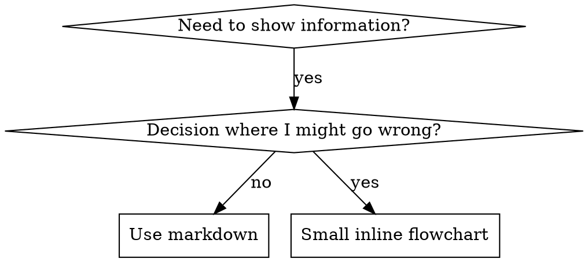

# Writing Skills

## 概览

**Writing skills 就是把 Test-Driven Development 应用到流程文档。**

**个人 skills 位于 agent-specific 目录（Claude Code 使用 `~/.claude/skills`，Codex 使用 `~/.agents/skills/`）**

你先写 test cases（带 subagents 的 pressure scenarios），观察它们失败（baseline behavior），编写 skill（文档），观察 tests 通过（agents 遵守），再 refactor（堵住漏洞）。

**核心原则：** 如果你没有观察过 agent 在没有该 skill 时失败，就不知道这个 skill 是否教对了东西。

**REQUIRED BACKGROUND:** 使用本 skill 前，你 MUST 理解 superpowers:test-driven-development。那个 skill 定义了基础 RED-GREEN-REFACTOR 循环。本 skill 把 TDD 适配到文档。

**Official guidance:** Anthropic 官方 skill authoring best practices 见 anthropic-best-practices.md。本文档提供额外 patterns 和 guidelines，用来补充本 skill 中聚焦 TDD 的方法。

## 什么是 Skill？

**skill** 是已验证 techniques、patterns 或 tools 的 reference guide。Skills 帮助未来的 Claude instances 找到并应用有效方法。

**Skills 是：** 可复用 techniques、patterns、tools、reference guides

**Skills 不是：** 你曾经如何解决某个问题的叙事

## Skills 的 TDD 映射

| TDD Concept | Skill Creation |
|-------------|----------------|
| **Test case** | 带 subagent 的 pressure scenario |
| **Production code** | Skill document (SKILL.md) |
| **Test fails (RED)** | 没有 skill 时 agent 违反规则（baseline） |
| **Test passes (GREEN)** | 存在 skill 时 agent 遵守 |
| **Refactor** | 在保持 compliance 的同时堵住漏洞 |
| **Write test first** | 写 skill 之前先运行 baseline scenario |
| **Watch it fail** | 记录 agent 使用的精确 rationalizations |
| **Minimal code** | 编写针对这些具体违规的 skill |
| **Watch it pass** | 验证 agent 现在遵守 |
| **Refactor cycle** | 找到新的 rationalizations → 堵住 → 重新验证 |

整个 skill creation 过程遵循 RED-GREEN-REFACTOR。

## 何时创建 Skill

**满足以下情况时创建：**
- Technique 对你而言不是直觉上显而易见的
- 你会在多个 projects 中再次引用它
- Pattern 适用范围广（不是 project-specific）
- 其他人会受益

**不要为以下情况创建：**
- 一次性 solutions
- 已在别处充分记录的 standard practices
- Project-specific conventions（放进 CLAUDE.md）
- 机械性约束（如果能用 regex/validation 强制，就自动化；把文档留给 judgment calls）

## Skill 类型

### Technique
有可遵循步骤的具体方法（condition-based-waiting、root-cause-tracing）

### Pattern
思考问题的方式（flatten-with-flags、test-invariants）

### Reference
API docs、syntax guides、tool documentation（office docs）

## 目录结构


```
skills/
  skill-name/
    SKILL.md              # Main reference (required)
    supporting-file.*     # Only if needed
```

**Flat namespace** - 所有 skills 位于一个可搜索 namespace 中

**以下内容使用单独文件：**
1. **Heavy reference**（100+ 行）- API docs、comprehensive syntax
2. **Reusable tools** - Scripts、utilities、templates

**以下内容保持 inline：**
- Principles and concepts
- Code patterns（< 50 行）
- 其他所有内容

## SKILL.md 结构

**Frontmatter (YAML):**
- 两个 required fields：`name` 和 `description`（所有 supported fields 见 [agentskills.io/specification](https://agentskills.io/specification)）
- 总计最多 1024 characters
- `name`：只使用 letters、numbers 和 hyphens（不要 parentheses、special chars）
- `description`：third-person，只描述何时使用（NOT 它做什么）
  - 以 "Use when..." 开头，聚焦 triggering conditions
  - 包含具体 symptoms、situations 和 contexts
  - **NEVER summarize the skill's process or workflow**（原因见 CSO section）
  - 如果可以，保持在 500 characters 以内

```markdown
---
name: Skill-Name-With-Hyphens
description: Use when [specific triggering conditions and symptoms]
---

# Skill Name

## Overview
What is this? Core principle in 1-2 sentences.

## When to Use
[Small inline flowchart IF decision non-obvious]

Bullet list with SYMPTOMS and use cases
When NOT to use

## Core Pattern (for techniques/patterns)
Before/after code comparison

## Quick Reference
Table or bullets for scanning common operations

## Implementation
Inline code for simple patterns
Link to file for heavy reference or reusable tools

## Common Mistakes
What goes wrong + fixes

## Real-World Impact (optional)
Concrete results
```


## Claude Search Optimization (CSO)

**对 discovery 至关重要：** 未来的 Claude 需要 FIND 你的 skill

### 1. Rich Description Field

**Purpose:** Claude 会读取 description 来决定给定 task 要加载哪些 skills。让它回答："Should I read this skill right now?"

**Format:** 以 "Use when..." 开头，聚焦 triggering conditions

**CRITICAL: Description = When to Use, NOT What the Skill Does**

description 应 ONLY 描述 triggering conditions。不要在 description 中总结 skill 的 process 或 workflow。

**为什么重要：** Testing 显示，当 description 总结 skill workflow 时，Claude 可能会遵循 description，而不是阅读完整 skill 内容。一个写着 "code review between tasks" 的 description 导致 Claude 只做了一次 review，尽管 skill 的 flowchart 明确要求两次 review（先 spec compliance，再 code quality）。

当 description 改成仅 "Use when executing implementation plans with independent tasks"（没有 workflow summary）时，Claude 正确读取 flowchart，并遵循了 two-stage review process。

**陷阱：** 总结 workflow 的 descriptions 会制造 Claude 可能采用的 shortcut。skill body 会变成 Claude 跳过的 documentation。

```yaml
# ❌ BAD: Summarizes workflow - Claude may follow this instead of reading skill
description: Use when executing plans - dispatches subagent per task with code review between tasks

# ❌ BAD: Too much process detail
description: Use for TDD - write test first, watch it fail, write minimal code, refactor

# ✅ GOOD: Just triggering conditions, no workflow summary
description: Use when executing implementation plans with independent tasks in the current session

# ✅ GOOD: Triggering conditions only
description: Use when implementing any feature or bugfix, before writing implementation code
```

**Content:**
- 使用具体 triggers、symptoms 和 situations，表明该 skill 适用
- 描述 *problem*（race conditions、inconsistent behavior），而不是 *language-specific symptoms*（setTimeout、sleep）
- 除非 skill 本身是 technology-specific，否则 triggers 保持 technology-agnostic
- 如果 skill 是 technology-specific，要在 trigger 中明确说明
- 使用 third person（会注入 system prompt）
- **NEVER summarize the skill's process or workflow**

```yaml
# ❌ BAD: Too abstract, vague, doesn't include when to use
description: For async testing

# ❌ BAD: First person
description: I can help you with async tests when they're flaky

# ❌ BAD: Mentions technology but skill isn't specific to it
description: Use when tests use setTimeout/sleep and are flaky

# ✅ GOOD: Starts with "Use when", describes problem, no workflow
description: Use when tests have race conditions, timing dependencies, or pass/fail inconsistently

# ✅ GOOD: Technology-specific skill with explicit trigger
description: Use when using React Router and handling authentication redirects
```

### 2. Keyword Coverage

使用 Claude 会搜索的词：
- Error messages："Hook timed out"、"ENOTEMPTY"、"race condition"
- Symptoms："flaky"、"hanging"、"zombie"、"pollution"
- Synonyms："timeout/hang/freeze"、"cleanup/teardown/afterEach"
- Tools：实际 commands、library names、file types

### 3. Descriptive Naming

**使用 active voice、verb-first：**
- ✅ `creating-skills`，不要 `skill-creation`
- ✅ `condition-based-waiting`，不要 `async-test-helpers`

### 4. Token Efficiency (Critical)

**Problem:** getting-started 和 frequently-referenced skills 会加载进 EVERY conversation。每个 token 都重要。

**Target word counts:**
- getting-started workflows：每个 <150 words
- Frequently-loaded skills：总计 <200 words
- Other skills：<500 words（仍要简洁）

**Techniques:**

**把 details 移到 tool help：**
```bash
# ❌ BAD: Document all flags in SKILL.md
search-conversations supports --text, --both, --after DATE, --before DATE, --limit N

# ✅ GOOD: Reference --help
search-conversations supports multiple modes and filters. Run --help for details.
```

**使用 cross-references：**
```markdown
# ❌ BAD: Repeat workflow details
When searching, dispatch subagent with template...
[20 lines of repeated instructions]

# ✅ GOOD: Reference other skill
Always use subagents (50-100x context savings). REQUIRED: Use [other-skill-name] for workflow.
```

**压缩 examples：**
```markdown
# ❌ BAD: Verbose example (42 words)
your human partner: "How did we handle authentication errors in React Router before?"
You: I'll search past conversations for React Router authentication patterns.
[Dispatch subagent with search query: "React Router authentication error handling 401"]

# ✅ GOOD: Minimal example (20 words)
Partner: "How did we handle auth errors in React Router?"
You: Searching...
[Dispatch subagent → synthesis]
```

**消除 redundancy：**
- 不重复 cross-referenced skills 中已有内容
- 不解释 command 本身已经显而易见的内容
- 不包含同一 pattern 的多个 examples

**Verification:**
```bash
wc -w skills/path/SKILL.md
# getting-started workflows: aim for <150 each
# Other frequently-loaded: aim for <200 total
```

**按你 DO 的事情或 core insight 命名：**
- ✅ `condition-based-waiting` > `async-test-helpers`
- ✅ `using-skills` not `skill-usage`
- ✅ `flatten-with-flags` > `data-structure-refactoring`
- ✅ `root-cause-tracing` > `debugging-techniques`

**Gerunds (-ing) 适合 processes：**
- `creating-skills`, `testing-skills`, `debugging-with-logs`
- Active，描述你正在采取的 action

### 4. Cross-Referencing Other Skills

**编写引用其他 skills 的 documentation 时：**

只使用 skill name，并带上明确 requirement markers：
- ✅ Good: `**REQUIRED SUB-SKILL:** Use superpowers:test-driven-development`
- ✅ Good: `**REQUIRED BACKGROUND:** You MUST understand superpowers:systematic-debugging`
- ❌ Bad: `See skills/testing/test-driven-development`（不清楚是否 required）
- ❌ Bad: `@skills/testing/test-driven-development/SKILL.md`（force-loads，消耗 context）

**为什么不用 @ links：** `@` syntax 会立即 force-load files，在你需要它们之前就消耗 200k+ context。

## Flowchart 用法



**ONLY 为以下情况使用 flowcharts：**
- 非显而易见的 decision points
- 你可能过早停止的 process loops
- "When to use A vs B" decisions

**Never 为以下情况使用 flowcharts：**
- Reference material → Tables、lists
- Code examples → Markdown blocks
- Linear instructions → Numbered lists
- 没有 semantic meaning 的 labels（step1、helper2）

graphviz style rules 见 @graphviz-conventions.dot。

**为你的 human partner 可视化：** 使用本目录中的 `render-graphs.js` 将某个 skill 的 flowcharts 渲染为 SVG：
```bash
./render-graphs.js ../some-skill           # Each diagram separately
./render-graphs.js ../some-skill --combine # All diagrams in one SVG
```

## Code Examples

**一个优秀 example 胜过许多平庸 examples**

选择最相关的 language：
- Testing techniques → TypeScript/JavaScript
- System debugging → Shell/Python
- Data processing → Python

**Good example:**
- 完整且 runnable
- 有良好 comments 解释 WHY
- 来自真实 scenario
- 清楚展示 pattern
- 可直接 adapt（不是 generic template）

**不要：**
- 用 5+ languages 实现
- 创建 fill-in-the-blank templates
- 编写 contrived examples

你很擅长 porting，一个优秀 example 就够了。

## 文件组织

### Self-Contained Skill
```
defense-in-depth/
  SKILL.md    # Everything inline
```
何时使用：所有内容都能放下，不需要 heavy reference

### Skill with Reusable Tool
```
condition-based-waiting/
  SKILL.md    # Overview + patterns
  example.ts  # Working helpers to adapt
```
何时使用：Tool 是 reusable code，而不只是 narrative

### Skill with Heavy Reference
```
pptx/
  SKILL.md       # Overview + workflows
  pptxgenjs.md   # 600 lines API reference
  ooxml.md       # 500 lines XML structure
  scripts/       # Executable tools
```
何时使用：Reference material 太大，无法 inline

## The Iron Law（与 TDD 相同）

```
NO SKILL WITHOUT A FAILING TEST FIRST
```

这同时适用于 NEW skills 和对现有 skills 的 EDITS。

先写 skill 再测试？删掉它，重新开始。
不测试就编辑 skill？同样违规。

**No exceptions:**
- 不因为 "simple additions" 例外
- 不因为 "just adding a section" 例外
- 不因为 "documentation updates" 例外
- 不要把未经测试的 changes 留作 "reference"
- 不要在运行 tests 时 "adapt"
- Delete means delete

**REQUIRED BACKGROUND:** superpowers:test-driven-development skill 解释了为什么这很重要。同样原则适用于 documentation。

## 测试所有 Skill 类型

不同 skill types 需要不同 test approaches：

### Discipline-Enforcing Skills（rules/requirements）

**Examples:** TDD、verification-before-completion、designing-before-coding

**Test with:**
- Academic questions：它们理解规则吗？
- Pressure scenarios：它们在压力下遵守吗？
- Multiple pressures combined：time + sunk cost + exhaustion
- 识别 rationalizations，并添加 explicit counters

**Success criteria:** Agent 在最大压力下遵守规则

### Technique Skills（how-to guides）

**Examples:** condition-based-waiting、root-cause-tracing、defensive-programming

**Test with:**
- Application scenarios：它们能正确应用 technique 吗？
- Variation scenarios：它们能处理 edge cases 吗？
- Missing information tests：instructions 是否有 gaps？

**Success criteria:** Agent 成功把 technique 应用到新 scenario

### Pattern Skills（mental models）

**Examples:** reducing-complexity、information-hiding concepts

**Test with:**
- Recognition scenarios：它们能识别 pattern 何时适用吗？
- Application scenarios：它们能使用 mental model 吗？
- Counter-examples：它们知道何时 NOT apply 吗？

**Success criteria:** Agent 正确识别何时/如何应用 pattern

### Reference Skills（documentation/APIs）

**Examples:** API documentation、command references、library guides

**Test with:**
- Retrieval scenarios：它们能找到正确信息吗？
- Application scenarios：它们能正确使用找到的信息吗？
- Gap testing：common use cases 是否被覆盖？

**Success criteria:** Agent 找到并正确应用 reference information

## 跳过 Testing 的常见 Rationalizations

| Excuse | Reality |
|--------|---------|
| "Skill is obviously clear" | 对你清楚 ≠ 对其他 agents 清楚。测试它。 |
| "It's just a reference" | References 可能有 gaps 和不清晰 sections。测试 retrieval。 |
| "Testing is overkill" | 未测试的 skills 总会有问题。15 min testing 能省下数小时。 |
| "I'll test if problems emerge" | Problems = agents 不能使用 skill。部署 BEFORE 先测试。 |
| "Too tedious to test" | Testing 比在 production 中 debug 坏 skill 更不繁琐。 |
| "I'm confident it's good" | 过度自信必然带来问题。无论如何都测试。 |
| "Academic review is enough" | Reading ≠ using。测试 application scenarios。 |
| "No time to test" | 部署未经测试的 skill 会浪费更多后续修复时间。 |

**所有这些都意味着：部署前测试。No exceptions。**

## 让 Skills 抵抗 Rationalization

强制 discipline 的 skills（例如 TDD）需要抵抗 rationalization。Agents 很聪明，在压力下会找到 loopholes。

**Psychology note:** 理解 persuasion techniques 为什么有效，能帮助你系统性应用它们。authority、commitment、scarcity、social proof 和 unity principles 的 research foundation（Cialdini, 2021; Meincke et al., 2025）见 persuasion-principles.md。

### 显式堵住每个 Loophole

不要只是陈述规则，还要禁止具体 workarounds：

<Bad>
```markdown
Write code before test? Delete it.
```
</Bad>

<Good>
```markdown
Write code before test? Delete it. Start over.

**No exceptions:**
- Don't keep it as "reference"
- Don't "adapt" it while writing tests
- Don't look at it
- Delete means delete
```
</Good>

### 处理 "Spirit vs Letter" Arguments

尽早添加 foundational principle：

```markdown
**Violating the letter of the rules is violating the spirit of the rules.**
```

这会切断整类 "I'm following the spirit" rationalizations。

### 构建 Rationalization Table

从 baseline testing 中捕获 rationalizations（见下面 Testing section）。Agents 提出的每个 excuse 都放进 table：

```markdown
| Excuse | Reality |
|--------|---------|
| "Too simple to test" | Simple code breaks. Test takes 30 seconds. |
| "I'll test after" | Tests passing immediately prove nothing. |
| "Tests after achieve same goals" | Tests-after = "what does this do?" Tests-first = "what should this do?" |
```

### 创建 Red Flags List

让 agents 在 rationalizing 时容易自查：

```markdown
## Red Flags - STOP and Start Over

- Code before test
- "I already manually tested it"
- "Tests after achieve the same purpose"
- "It's about spirit not ritual"
- "This is different because..."

**所有这些都意味着：Delete code. Start over with TDD.**
```

### 为 Violation Symptoms 更新 CSO

在 description 中添加你 ABOUT to violate the rule 时的 symptoms：

```yaml
description: use when implementing any feature or bugfix, before writing implementation code
```

## Skills 的 RED-GREEN-REFACTOR

遵循 TDD cycle：

### RED: Write Failing Test（Baseline）

在 WITHOUT 该 skill 的情况下，用 subagent 运行 pressure scenario。记录精确 behavior：
- 它们做了哪些选择？
- 它们使用了哪些 rationalizations（verbatim）？
- 哪些 pressures 触发了 violations？

这就是 "watch the test fail"：写 skill 前，你必须看到 agents 自然会做什么。

### GREEN: Write Minimal Skill

编写处理这些 specific rationalizations 的 skill。不要为 hypothetical cases 添加额外内容。

在 WITH skill 的情况下运行相同 scenarios。Agent 现在应该遵守。

### REFACTOR: Close Loopholes

Agent 发现了新的 rationalization？添加 explicit counter。重新测试，直到 bulletproof。

**Testing methodology:** 完整 testing methodology 见 @testing-skills-with-subagents.md：
- 如何编写 pressure scenarios
- Pressure types（time、sunk cost、authority、exhaustion）
- 系统性 plugging holes
- Meta-testing techniques

## Anti-Patterns

### ❌ Narrative Example
"In session 2025-10-03, we found empty projectDir caused..."
**Why bad:** 太 specific，不可复用

### ❌ Multi-Language Dilution
example-js.js, example-py.py, example-go.go
**Why bad:** 质量平庸，维护负担高

### ❌ Code in Flowcharts
```dot
step1 [label="import fs"];
step2 [label="read file"];
```
**Why bad:** 不能 copy-paste，难读

### ❌ Generic Labels
helper1, helper2, step3, pattern4
**Why bad:** Labels 应该有 semantic meaning

## STOP: 进入下一个 Skill 前

**写完 ANY skill 后，你 MUST STOP 并完成 deployment process。**

**Do NOT:**
- 不要批量创建 multiple skills 而不逐个测试
- 不要在当前 skill verified 前进入下一个 skill
- 不要因为 "batching is more efficient" 而跳过 testing

**下面的 deployment checklist 对 EACH skill 都是 MANDATORY。**

部署未经测试的 skills = 部署未经测试的 code。这违反 quality standards。

## Skill Creation Checklist（TDD Adapted）

**IMPORTANT: 使用 TodoWrite 为下面 EACH checklist item 创建 todos。**

**RED Phase - Write Failing Test:**
- [ ] 创建 pressure scenarios（discipline skills 使用 3+ combined pressures）
- [ ] WITHOUT skill 运行 scenarios - verbatim 记录 baseline behavior
- [ ] 识别 rationalizations/failures 中的 patterns

**GREEN Phase - Write Minimal Skill:**
- [ ] Name 只使用 letters、numbers、hyphens（不要 parentheses/special chars）
- [ ] YAML frontmatter 包含 required `name` 和 `description` fields（最多 1024 chars；见 [spec](https://agentskills.io/specification)）
- [ ] Description 以 "Use when..." 开头，并包含 specific triggers/symptoms
- [ ] Description 使用 third person
- [ ] 全文包含便于 search 的 keywords（errors、symptoms、tools）
- [ ] 有清晰 overview 和 core principle
- [ ] 处理 RED 中识别出的 specific baseline failures
- [ ] Code inline 或 link 到单独文件
- [ ] 一个优秀 example（不是 multi-language）
- [ ] WITH skill 运行 scenarios - 验证 agents 现在遵守

**REFACTOR Phase - Close Loopholes:**
- [ ] 从 testing 中识别 NEW rationalizations
- [ ] 添加 explicit counters（如果是 discipline skill）
- [ ] 从所有 test iterations 构建 rationalization table
- [ ] 创建 red flags list
- [ ] 重新测试，直到 bulletproof

**Quality Checks:**
- [ ] 只有 decision non-obvious 时才使用 small flowchart
- [ ] Quick reference table
- [ ] Common mistakes section
- [ ] 不要 narrative storytelling
- [ ] Supporting files 只用于 tools 或 heavy reference

**Deployment:**
- [ ] 将 skill commit 到 git，并 push 到你的 fork（如果已配置）
- [ ] 考虑通过 PR 贡献回去（如果 broad useful）

## Discovery Workflow

未来 Claude 如何找到你的 skill：

1. **Encounters problem**（"tests are flaky"）
3. **Finds SKILL**（description matches）
4. **Scans overview**（它相关吗？）
5. **Reads patterns**（quick reference table）
6. **Loads example**（只在 implementing 时）

**为这个 flow 优化** - 尽早并频繁放入 searchable terms。

## The Bottom Line

**Creating skills 就是面向 process documentation 的 TDD。**

同一条 Iron Law：No skill without failing test first。
同一个 cycle：RED（baseline）→ GREEN（write skill）→ REFACTOR（close loopholes）。
同样的 benefits：更好的质量、更少惊喜、bulletproof results。

如果你对 code 遵循 TDD，也要对 skills 遵循它。这是同一种 discipline 在 documentation 上的应用。
